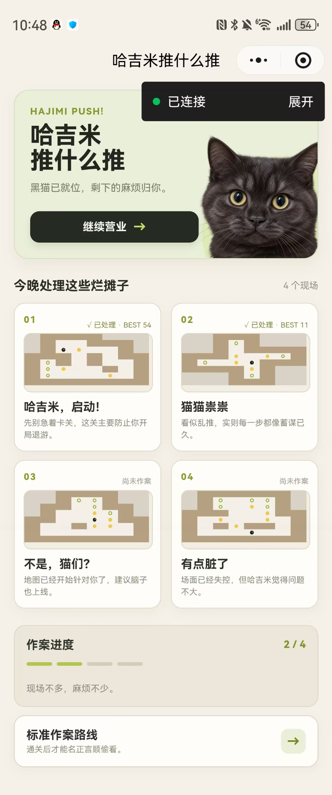
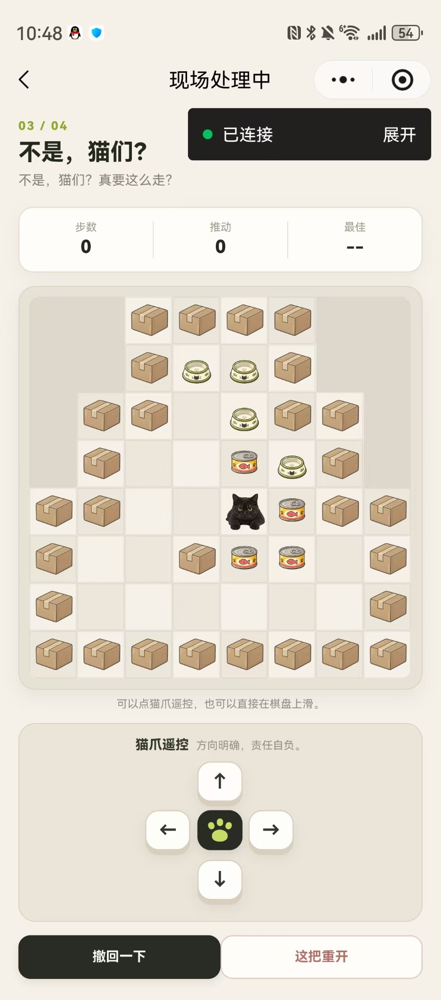
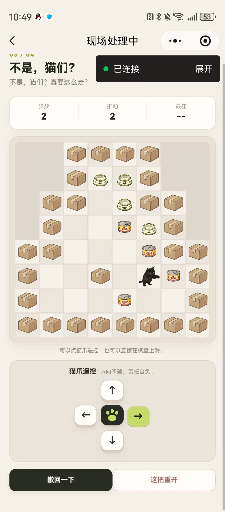
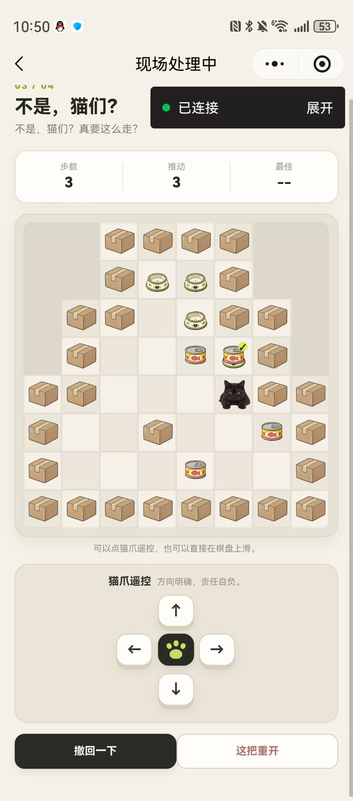
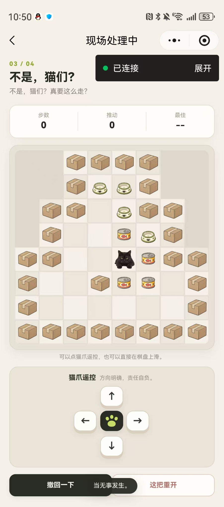
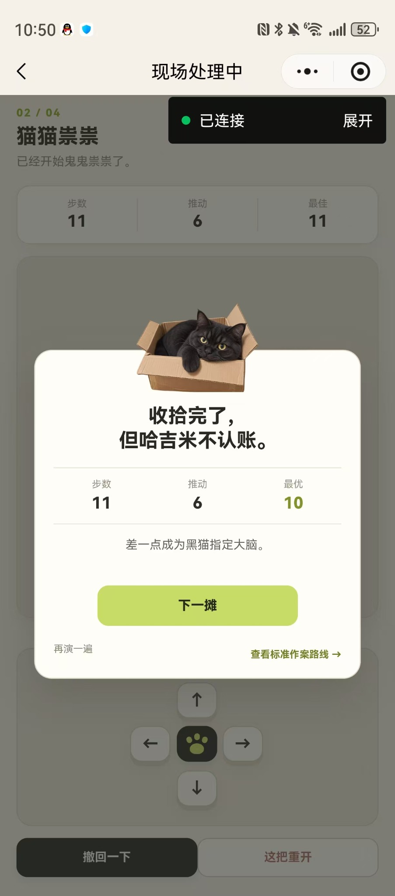
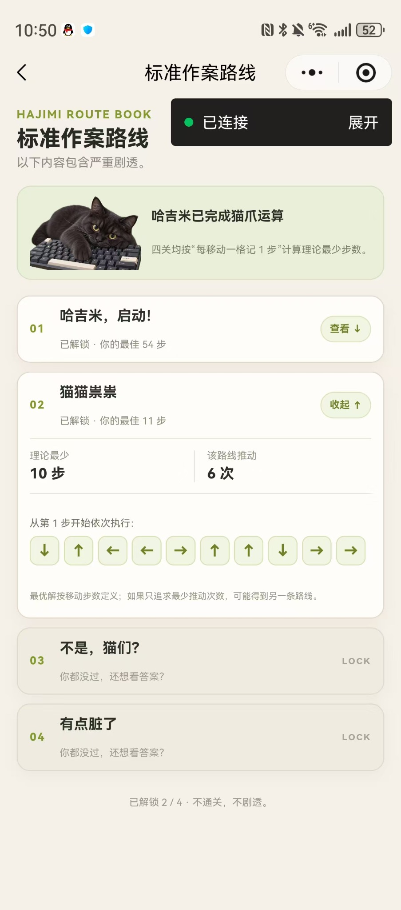

<center>姓名：伍紫涵  学号：24020007139</center>

| 项目 | 内容 |
| -------------------- | -------------------------------- |
| 姓名和学号？ | 伍紫涵，24020007139 |
| 本实验属于哪门课程？ | 中国海洋大学26夏《移动软件开发》 |
| 实验名称？ | 实验4：推箱子 |
| 开发工具？ | 微信开发者工具 Stable 2.01.2510260 |
| 主要技术？ | WXML、WXSS、JavaScript、Canvas 2D、微信小程序 Storage |
| 代码仓库地址？ | https://github.com/qiqiqisi/ouc-mobile-software-development |

## 一、实验内容

本实验要求完成一个推箱子小程序，主要包括关卡选择、地图绘制、人物移动、箱子推动和通关判断等功能。

在完成实验基本要求的基础上，我没有继续使用普通人物和箱子的设计，而是把整个游戏改成了以我家黑猫“哈吉米”为主角的版本，项目名称为“哈吉米推什么推”。游戏中的玩家改成哈吉米，箱子改成猫罐头，目标位置改成猫饭碗，墙体改成快递纸箱。同时重新设计了页面配色和文案，并加入步数统计、推动次数、撤回、重新开始、本地最佳成绩、滑动操作和通关后查看最优路线等功能。

### 1. 最终效果

为了方便查看，先展示最后完成后的效果。

首页顶部使用哈吉米的真实照片作为主视觉，页面整体采用暖米白和浅绿色。首页中间显示四个关卡，并可以看到已经完成的关卡和当前最佳成绩。四个关卡分别命名为“哈吉米，启动！”“猫猫祟祟”“不是，猫们？”和“有点脏了”。



图1 首页最终效果

点击关卡后进入游戏页面。页面上方显示当前关卡、步数、推动次数和最佳成绩，中间为 8×8 游戏地图，下方为方向控制区。除了点击方向按钮，也可以直接在棋盘上滑动。



图2 游戏初始界面

实际移动时，玩家位置和罐头位置会同步更新。推动罐头时，哈吉米会切换到另一张伸爪的图片，用来表现推动动作。



图3 推动效果

当罐头被推到饭碗位置后，会显示绿色完成标记，方便判断哪些罐头已经归位。



图4 罐头归位效果

点击“这把重开”后，当前关卡会恢复到初始状态，同时步数和推动次数重新变为 0。页面底部会显示“当无事发生。”的提示。



图5 重新开始效果

完成一关后会显示结算界面，统计本次步数、推动次数和理论最优步数。如果当前步数和最优解比较接近，还会显示对应的评价文案。



图6 通关结算

通关后可以进入“标准作案路线”页面查看这一关的理论最优路线。没有通关的关卡不会提前显示答案。



图7 标准作案路线页面

### 2. 项目结构

本实验把页面、地图数据、游戏逻辑和本地存储分开保存，主要结构如下：

```text
hajimi_push_miniprogram/
├── assets/
│   ├── game/              罐头、猫碗和纸箱图片
│   └── hajimi/            哈吉米图片
├── data/
│   └── levels.js          四关地图和最优路线
├── pages/
│   ├── index/             首页和关卡选择
│   ├── game/              游戏页面
│   └── solutions/         标准作案路线
├── utils/
│   ├── sokoban.js         推箱子核心逻辑
│   └── storage.js         本地成绩保存
├── app.js
├── app.json
└── app.wxss
```

这样做以后，地图数据和页面显示没有全部写在同一个文件中。后面修改 UI 或者替换图片时，不需要重新修改移动和通关判断。

### 3. 设计哈吉米主题

这次实验中我想做出和普通推箱子不一样的效果，所以从一开始就决定使用我家的黑猫哈吉米作为玩家角色。

最初考虑过把可推动物体改成毛球，后来实际设计时改成了猫罐头，因为罐头和猫饭碗之间的关系更直观。最后确定的对应关系是：哈吉米对应玩家，猫罐头对应箱子，猫饭碗对应目标位置，快递纸箱对应墙体。

页面最开始也尝试过深色背景，但哈吉米本身就是黑猫，深色背景会让角色不够明显，而且整个页面显得比较压抑。后来把整体颜色改成暖米白和浅绿色，哈吉米的黑色反而能够成为页面中最明显的部分。

文案也一起进行了修改。比如首页按钮使用“开始作案”和“继续营业”，重新开始改成“这把重开”，答案页面改成“标准作案路线”。这些内容不会影响操作理解，但能让整个小程序更有自己的风格。

### 4. 保存关卡地图

四个关卡都使用 8×8 二维数组保存，并统一放在 `data/levels.js` 中。

地图中使用不同数字表示不同元素：

| 数值 | 含义 |
| --- | --- |
| 0 | 地图外区域 |
| 1 | 墙体 |
| 2 | 普通道路 |
| 3 | 目标位置 |
| 4 | 可推动物体 |
| 5 | 玩家 |

例如第三关“不是，猫们？”的数据中同时保存了纸箱、饭碗、罐头和哈吉米的初始位置。页面进入游戏时，再通过 `parseMap()` 将二维数组解析成实际运行状态。

```javascript
function parseMap(map) {
  const floors = new Set()
  const walls = new Set()
  const goals = new Set()
  const boxes = new Set()
  let player = { row: 0, col: 0 }

  map.forEach((line, row) => {
    line.forEach((value, col) => {
      const key = keyOf(row, col)

      if (value === 1) {
        walls.add(key)
        return
      }

      if ([2, 3, 4, 5].includes(value)) {
        floors.add(key)
      }

      if (value === 3) {
        goals.add(key)
      } else if (value === 4) {
        boxes.add(key)
      } else if (value === 5) {
        player = { row, col }
      }
    })
  })

  return { floors, walls, goals, boxes, player }
}
```

相比直接在二维数组中反复修改数字，这样处理以后，判断玩家位置、罐头位置和目标位置会更方便。

### 5. 使用 Canvas 绘制游戏地图

游戏地图使用 Canvas 2D 绘制。进入游戏页面后，先根据当前屏幕宽度确定 Canvas 实际尺寸，再按照 8×8 地图计算单个格子的大小。

绘制时先画棋盘背景，再根据当前地图状态叠加纸箱、猫碗、罐头和哈吉米图片。这里没有直接把纸箱格子全部改成棕色，而是让纸箱下面继续使用和其他格子一样的棋盘颜色，只在上面叠加纸箱图片。实际看起来会比较轻，不会出现一大片棕色区域。

哈吉米有普通状态和推动状态两张图片。正常移动时显示普通图片，发生推动时短暂显示伸爪版本，所以图3中可以看到哈吉米在移动之后使用了不同姿势。

### 6. 实现玩家移动和推动判断

玩家每次向一个方向移动时，先计算下一格的位置。

如果下一格不是可走区域，本次移动直接失败。如果下一格有罐头，则还需要继续判断罐头前方是否为空。如果罐头前方是墙或者另一个罐头，也不能继续推动。

核心逻辑如下：

```javascript
function tryMove(state, direction) {
  const delta = DIRECTIONS[direction]
  if (!delta) return { moved: false, pushed: false }

  const nextRow = state.player.row + delta.dr
  const nextCol = state.player.col + delta.dc
  const nextKey = keyOf(nextRow, nextCol)

  if (!state.floors.has(nextKey)) {
    return { moved: false, pushed: false }
  }

  let pushed = false

  if (state.boxes.has(nextKey)) {
    const boxRow = nextRow + delta.dr
    const boxCol = nextCol + delta.dc
    const boxKey = keyOf(boxRow, boxCol)

    if (!state.floors.has(boxKey) || state.boxes.has(boxKey)) {
      return { moved: false, pushed: false }
    }

    state.boxes.delete(nextKey)
    state.boxes.add(boxKey)
    pushed = true
  }

  state.player = { row: nextRow, col: nextCol }
  return { moved: true, pushed }
}
```

每次合法移动后步数加 1，发生推动时推动次数再加 1。

### 7. 增加方向按钮和滑动操作

实验本身需要提供上下左右操作，因此游戏页面保留了方向控制区域。我没有直接使用四个普通长按钮，而是重新设计成一个猫爪遥控器，中间放猫爪图标，四周对应上下左右。

除了按钮操作，还给 Canvas 增加了触摸事件。程序记录手指按下和抬起的位置，再比较横向和纵向移动距离，从而判断用户向哪个方向滑动。

这样在真机上既可以点击方向按钮，也可以直接在棋盘上滑动。

### 8. 实现撤回和重新开始

推箱子很容易因为一步走错导致后面无法继续，所以我增加了“撤回一下”功能。

每次合法移动之前都会先保存当前状态，包括哈吉米的位置和所有罐头的位置：

```javascript
function snapshot(state) {
  return {
    player: {
      row: state.player.row,
      col: state.player.col
    },
    boxes: Array.from(state.boxes)
  }
}
```

点击撤回后，再通过 `restore()` 恢复上一步状态，同时恢复对应的步数和推动次数。

“这把重开”则直接重新加载当前关卡的初始状态。图5是在第三关操作后的测试结果，可以看到步数和推动次数已经重新变成 0。

### 9. 通关判断和成绩保存

每次移动完成后，程序检查所有罐头是否都已经进入目标位置。

```javascript
function isSolved(state) {
  if (state.boxes.size !== state.goals.size) {
    return false
  }

  for (const box of state.boxes) {
    if (!state.goals.has(box)) {
      return false
    }
  }

  return true
}
```

如果全部罐头都在目标位置，就认为当前关卡完成。

通关后会保存本次步数和推动次数，并使用微信小程序 Storage 保存历史记录。再次进入小程序时，首页会显示已经完成的关卡以及自己的最佳成绩。图1中前两关已经完成，首页显示了 `BEST 54` 和 `BEST 11`。

### 10. 计算标准作案路线

除了实验要求中的基本功能，我还为四个关卡计算了理论最少步数。

这里按照“每移动一格记 1 步”作为最优解标准，使用 BFS 搜索玩家位置和全部罐头位置组成的状态。BFS 第一次找到通关状态时，对应路线就是最少步数路线。

为了避免小程序每次打开答案页都重新计算，我在开发阶段提前求出四关结果，再直接保存到 `levels.js` 中。

| 关卡 | 理论最少步数 | 该路线推动次数 |
| --- | ---: | ---: |
| 哈吉米，启动！ | 51 | 11 |
| 猫猫祟祟 | 10 | 6 |
| 不是，猫们？ | 51 | 14 |
| 有点脏了 | 61 | 20 |

用户只有自己完成对应关卡后才能查看具体路线。图7中前两关已经解锁，第三关和第四关仍然显示 `LOCK`。

### 11. 真机测试

最后使用手机进行了真机调试。首页、关卡进入、按钮移动、滑动移动、罐头归位、重新开始、通关结算和答案页都能够正常显示。

从图2到图4可以看到第三关从初始状态开始移动，步数和推动次数会随着操作变化，哈吉米和罐头位置也会正确更新。图6是在第二关完成后的结算结果，本次用了 11 步和 6 次推动，理论最优为 10 步。

真机测试过程中也发现 Canvas 和普通 `view` 的表现并不完全一样，尤其是页面切换、Canvas 初次创建和通关弹层显示时需要额外处理，这部分也是本次实验花时间比较多的地方。

## 二、问题总结与体会

本次实验中最麻烦的问题主要集中在 Canvas。

最开始 Canvas 中的本地图片没有正常显示。普通 `<image>` 组件可以直接加载的路径，放到 Canvas 中并不能完全照搬。后来改成通过当前 Canvas 节点创建 Image，并使用对应的相对路径加载图片，哈吉米、罐头、猫碗和纸箱才全部正常显示。

第二个问题是 Canvas 的层级。早期版本中，进入游戏时地图会短暂盖到首页上，通关以后地图也会盖住自己写的结算弹层。单纯修改 `z-index` 并不能稳定解决。后来改成在页面切换和显示结算之前真正销毁 Canvas，需要继续显示游戏时再重新创建，这个问题才解决。

后面还遇到过第一次进入游戏页时地图位置偏移的问题。地图本身的尺寸和绘制内容没有错，因为只要轻微滚动页面，Canvas 就会回到正确位置。最后通过延后 Canvas 创建、固定它在棋盘容器中的位置，并在初始化后刷新一次页面位置解决了这个问题。

相比前几个实验，本次实验第一次大量使用 Canvas，也加入了更完整的游戏状态管理。通过实际开发，我对二维地图、玩家和箱子状态、碰撞判断、Canvas 图片绘制以及页面生命周期有了更直观的理解。

另外，这次我也尝试把一个普通实验做成更有个人特点的版本。从哈吉米这个主角出发，把罐头、猫碗、纸箱、关卡名称和页面文案都统一起来，最后做出来的效果会比简单换一张人物图片完整很多。

这次实验中 UI 也改过几轮。最开始的深色版本实际效果并不好，后来根据黑猫本身的颜色重新调整成现在的浅色页面。我感觉这一点也比较重要，很多 UI 在真正跑起来之前很难只靠想象判断效果，实际截图和真机测试还是很有必要。

GitHub 代码仓库：

https://github.com/qiqiqisi/ouc-mobile-software-development
