# 实验3：高校新闻网

| 项目 | 内容 |
| --- | --- |
| 姓名 | 伍紫涵 |
| 学号 | 24020007139 |
| 课程 | 移动软件开发 |
| 开发工具 | 微信开发者工具 |
| 主要技术 | WXML、WXSS、JavaScript、Storage、微信小程序原生能力 |

## 一、实验内容

本次实验要求完成一个高校新闻网小程序，包括首页新闻展示、新闻详情、收藏和个人中心等功能。

在完成原实验要求的基础上，我没有继续使用 Demo 中比较旧的新闻，而是将内容换成了中国海洋大学近期的官方新闻，并重新整理了页面样式。后面又在这个基础上增加了新闻搜索、分类筛选、快捷收藏、最近阅读、批量管理和微信分享等功能，使整个小程序更接近一个可以实际使用的校园新闻应用。

### 1. 最终效果

首页仍然使用“海大 · 正发生”的设计，顶部是中国海洋大学标识和重点新闻轮播，下面展示最新新闻。

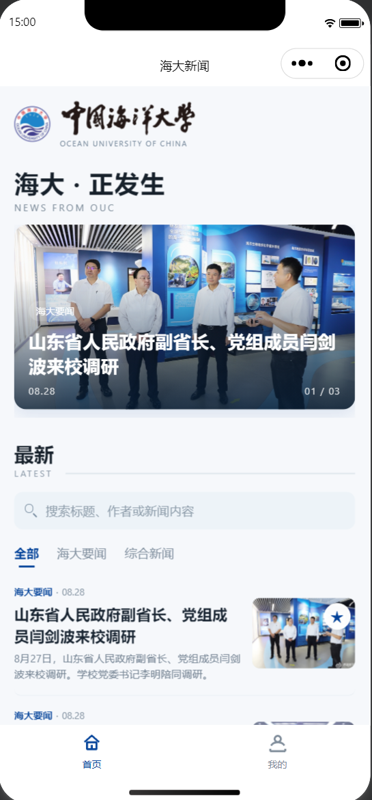

个人中心主要分为用户资料、收藏和最近阅读三个部分。收藏和最近阅读使用 Tab 切换，没有把两个长列表直接堆在同一个页面中。

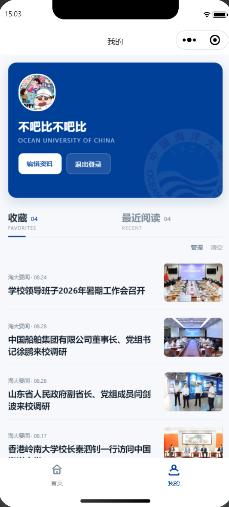

### 2. 项目结构

项目主要还是按照微信小程序常见的页面结构组织，没有为了增加功能拆出太多文件。

```text
lab03_complete/
├── images/
│   ├── brand/            # 海大校徽和文字标识
│   ├── news/             # 新闻图片
│   └── tab/              # 底部导航图标
├── pages/
│   ├── index/            # 首页
│   ├── detail/           # 新闻详情
│   └── my/               # 我的
├── utils/
│   └── common.js         # 新闻、收藏、历史记录等公共数据
├── app.js
├── app.json
├── app.wxss
└── sitemap.json
```

其中首页和“我的”属于底部 `tabBar` 的两个主要页面，新闻详情通过 `wx.navigateTo()` 打开。

### 3. 首页新闻展示

首页首先展示重点新闻轮播图，点击轮播图或新闻列表中的某一条新闻，可以进入对应的新闻详情。

为了让首页使用起来更方便，我在原有新闻列表上增加了搜索和分类筛选。

#### （1）新闻搜索

搜索框可以根据新闻标题、作者和正文内容进行筛选。例如输入“研究生”以后，只显示和研究生相关的新闻。

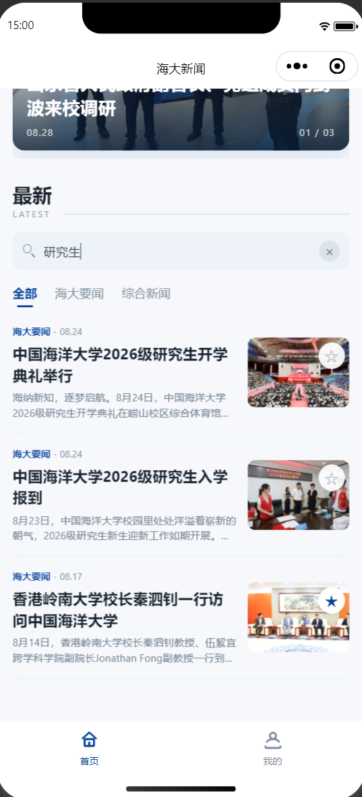

搜索和分类并不是两套互相覆盖的逻辑，而是一起根据当前关键词和分类重新计算需要显示的新闻。

```js
function filterNews(options = {}) {
  const keyword = String(options.keyword || '').trim().toLowerCase();
  const category = options.category || '全部';

  return NEWS.filter(item => {
    const categoryMatched =
      category === '全部' || item.category === category;
    const keywordMatched =
      !keyword || getSearchableText(item).includes(keyword);

    return categoryMatched && keywordMatched;
  });
}
```

#### （2）新闻分类

目前可以在“全部”“海大要闻”“综合新闻”之间进行切换。分类采用文字和短下划线的形式，没有使用太多按钮，整体仍然保持原来的页面风格。

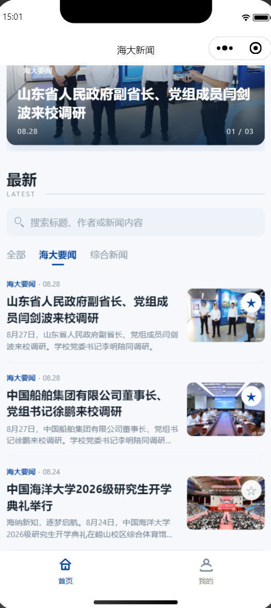

#### （3）首页快捷收藏

每条新闻图片右上角增加了星星：

```text
☆  未收藏
★  已收藏
```

点击星星只改变收藏状态，不会误进入新闻详情。收藏状态会同步到首页、详情页和“我的”页面。

收藏数据只保存新闻 ID：

```js
function toggleFavorite(id) {
  const newsId = String(id);
  let ids = getFavoriteIds();
  const exists = ids.includes(newsId);

  if (exists) {
    ids = ids.filter(item => item !== newsId);
  } else {
    ids.unshift(newsId);
  }

  wx.setStorageSync(FAVORITES_KEY, ids);
  return !exists;
}
```

这样不需要把整篇新闻重复存一遍。

### 4. 新闻详情

点击新闻后，通过新闻 ID 找到对应数据并进入详情页。详情页展示标题、作者、来源、时间、正文、图片和图注。

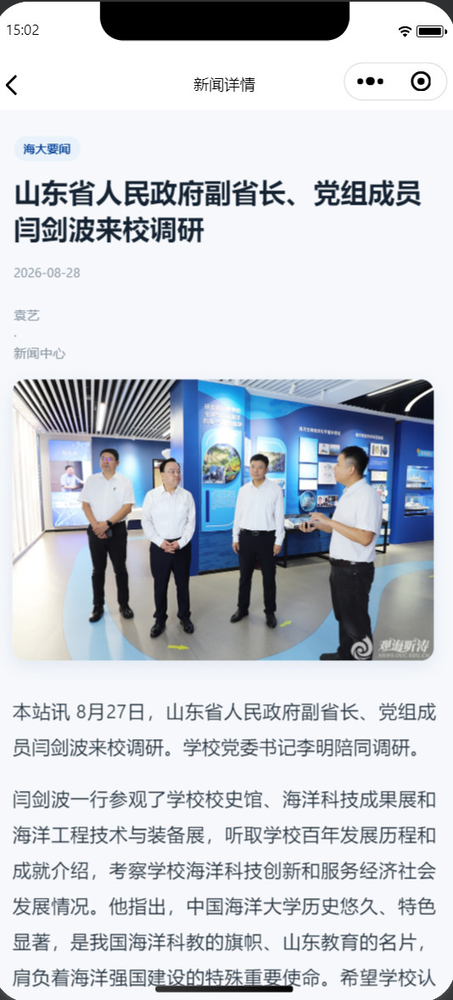

正文中的图片和文字按照原新闻的顺序保存，因此一篇新闻中有多张图片时，也能够按顺序显示出来。

在文章结尾保留了收藏和分享两个操作。原来比较大的蓝色收藏按钮后来改成了星星，这样和首页的收藏方式保持一致，也不会太抢正文的视觉。

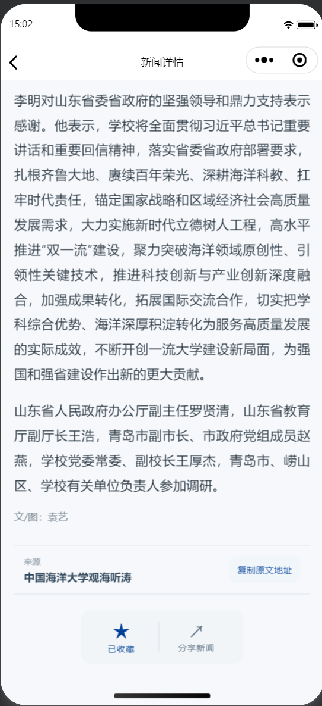

### 5. 新闻分享

详情页增加了微信原生分享功能。分享时会带上当前新闻标题和新闻 ID，对方打开分享卡片后可以直接进入对应新闻详情。

```js
onShareAppMessage() {
  const article = this.data.article;

  return {
    title: article.title,
    path: `/pages/detail/detail?id=${article.id}`
  };
}
```

实际分享效果如下：

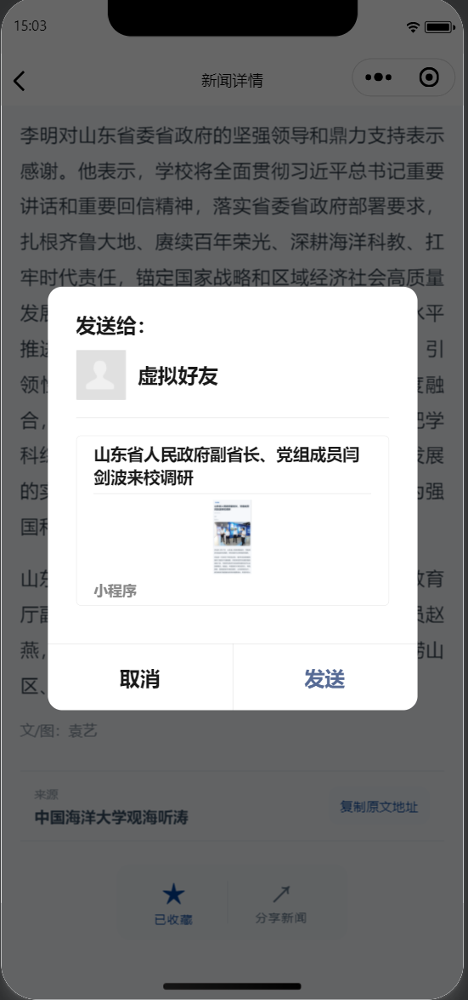

### 6. 个人资料

“我的”页面顶部是个人资料卡，可以保存头像和昵称。

第一次使用微信快捷登录时，需要选择微信头像并确认昵称；资料会保存在本地。后面如果退出登录，再次进入时可以直接恢复之前保存的资料，不需要每次都重新设置。

个人资料需要修改时，点击“编辑资料”会打开独立的编辑浮层，而不是直接改变整个个人卡片的布局。

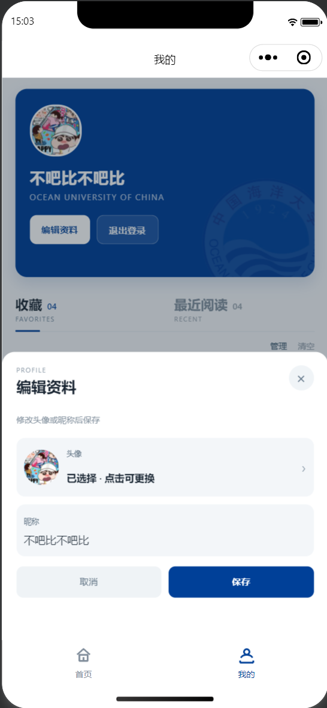

头像文件使用 `wx.getFileSystemManager().saveFile()` 保存到小程序本地文件目录，避免只保存临时图片地址。

### 7. 收藏管理

收藏页面除了可以查看已经收藏的新闻，还增加了三种删除方式。

第一种是左滑单条新闻，出现“取消收藏”按钮。

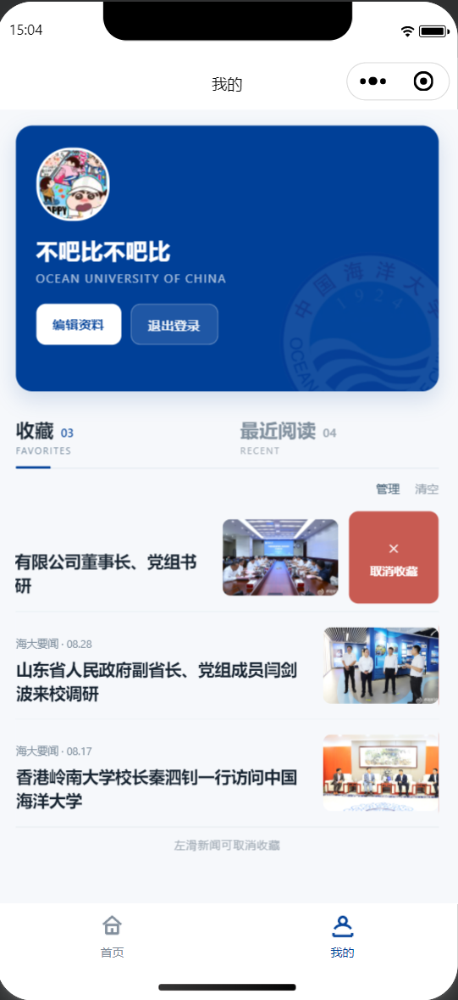

第二种是进入“管理”模式，可以选择多条新闻，也可以全选，然后一次批量删除。

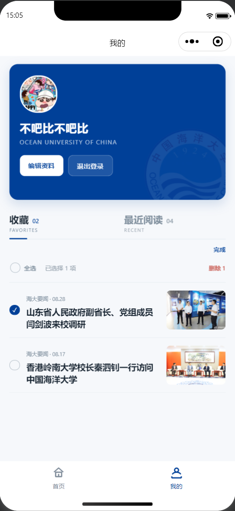

第三种是直接清空全部收藏。为了防止误操作，清空前会弹出确认窗口。

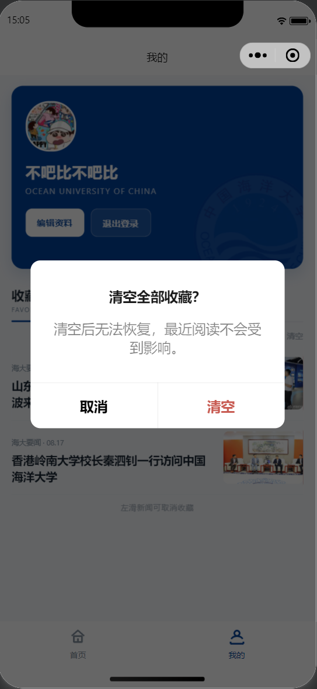

全部收藏删除以后，会显示单独的空状态页面。

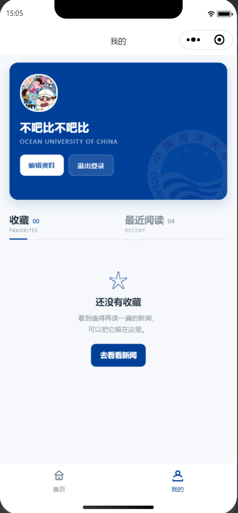

### 8. 最近阅读

每次真正进入一篇新闻详情时，都会记录这篇新闻的 ID 和最后阅读时间。

```js
function addHistory(id) {
  const newsId = String(id);

  const next = getHistoryRecords()
    .filter(item => item.id !== newsId);

  next.unshift({
    id: newsId,
    viewedAt: Date.now()
  });

  wx.setStorageSync(HISTORY_KEY, next.slice(0, 20));
}
```

如果同一篇新闻再次打开，不会增加一条重复记录，而是更新时间并移动到最前面。历史记录最多保留最近 20 条。

最近阅读中的新闻也可以直接点击右上角星星进行收藏，不需要重新进入新闻详情。

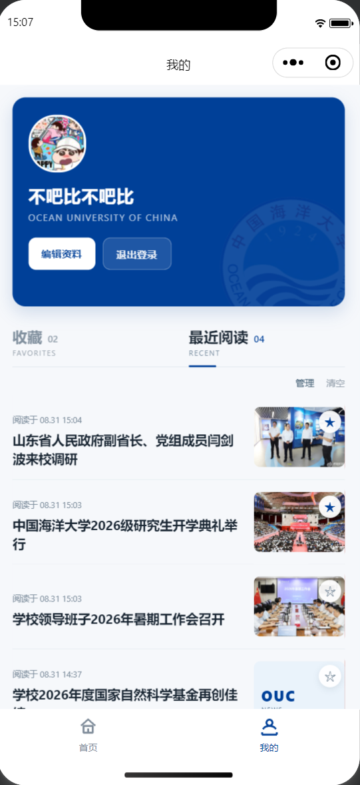

最近阅读和收藏使用同样的管理方式，支持左滑单条删除、批量删除、全选和一键清空。

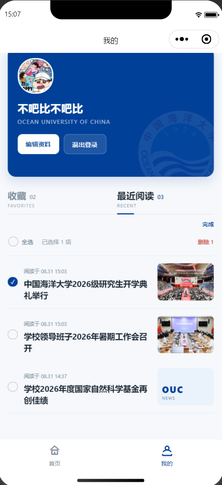

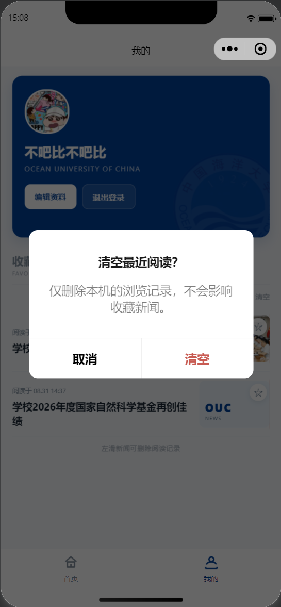

清空以后显示最近阅读的空状态。

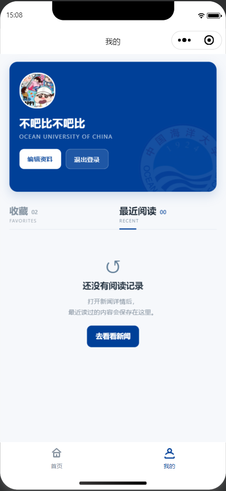

### 9. 新闻数据的整理

实验原始 Demo 中的新闻和图片比较旧，所以这次重新整理了中国海洋大学近期的官方新闻。

一篇新闻中除了标题以外，还可能有多段正文、多张图片和图注。如果全部手动复制，很容易漏掉内容或者写错图片路径。因此开发过程中使用 AI 辅助编写了 Python 同步脚本，把重复的数据整理工作自动化：

```text
海大官方新闻页面
      ↓
读取标题、作者、日期、正文
      ↓
下载新闻图片
      ↓
整理图片和正文顺序
      ↓
写入 common.js
      ↓
微信开发者工具检查
```

最终小程序中使用了 8 篇海大官方新闻，并把需要的新闻图片保存到了项目本地。AI 在这里主要用于辅助处理比较重复的数据整理工作，最后的新闻内容、页面效果和运行结果还是需要自己检查。

### 10. 本地数据存储

本实验中的收藏、最近阅读和用户资料主要使用微信小程序本地 Storage 保存。

```text
lab03_favorite_ids   收藏新闻 ID
lab03_history        最近阅读记录
lab03_user_profile   用户头像和昵称
lab03_logged_in      当前登录状态
```

通过这一部分，我对页面 `data` 和本地 Storage 的区别更清楚了。页面切换以后，收藏和历史记录并不是页面之间直接传过去的，而是重新从本地数据中读取。

需要注意的是，本地 Storage 和本地保存的头像都属于当前设备上的数据。如果清除小程序缓存或数据、重新安装相关环境，或者更换设备，之前保存的收藏、浏览记录和个人资料都可能丢失。

## 二、问题总结与体会

### 1. 新闻数据的整理

原实验中的新闻数据比较旧，所以这次重新使用海大官方新闻。新闻正文和图片数量比一开始想的多，最后使用 AI 辅助生成 Python 脚本完成重复的数据整理，再在微信开发者工具中检查结果。

### 2. 页面数据的同步

增加首页收藏、详情收藏、最近阅读快捷收藏以后，同一个收藏状态会在多个页面出现。最后统一使用 `common.js` 和 Storage 管理数据，并在页面重新显示时刷新状态，这样首页、详情和“我的”中的星星能够保持一致。

### 3. 实验收获

这次实验除了完成基本的新闻展示和收藏以外，还实际使用了 `tabBar`、页面传参、Storage、搜索筛选、微信分享、头像昵称、滑动操作和批量管理等功能。

相比前两个实验，这次更像是在做一个完整的小程序。我也更清楚一个功能从数据保存、页面显示到不同页面之间同步，大概需要怎样组织。
