# 实验5：鸿蒙系统里的计算器
## 一、实验内容

本次实验主要学习 HarmonyOS 应用的基本开发流程。前面几次实验一直使用微信开发者工具，这次第一次使用 **DevEco Studio + ArkTS + HarmonyOS 模拟器**。我先按照实验步骤完成开发环境和模拟器配置，运行最基础的 Hello World，再导入官方 Calculator 示例。在官方计算器能够正常运行后，我没有只停留在四则运算和界面换色，而是在原有项目上继续扩展，最终加入了 **标准、科学、程序员三种计算方式**，并补充 **Decimal 高精度、BigInt 程序员运算、历史记录、历史恢复、结果复制、表达式编辑以及多种外观设置**。其中程序员模式不只是查看不同进制，而是可以按照 BIN/OCT/DEC/HEX 直接输入和计算；历史记录也不是单纯保存结果，而是可以恢复当时的计算模式和相关设置。

### 1. 最终效果

为了方便查看，先展示目前完成的主要界面。默认的简洁模式采用浅灰背景、白色数字键、浅蓝色运算键和深色等号，整体尽量保持清楚，不把太多设置直接堆在主页面上。

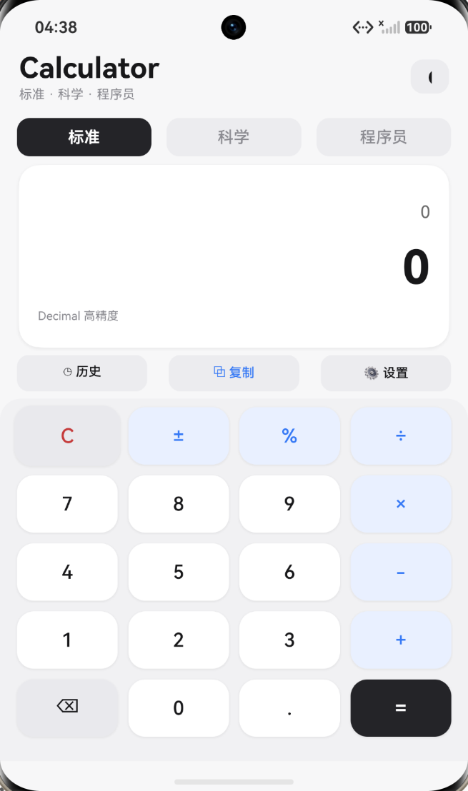

从图 1 也可以看到主界面保留了 **历史、复制、设置** 三个常用入口。历史用于查看和恢复以前正式提交的计算，复制可以把当前合法结果直接写入系统剪贴板，这两个功能不需要再进入单独页面才能使用。

科学模式与标准模式共用同一份表达式，科学页面主要提供 `sin`、`cos`、`tan`、`log`、`ln`、平方、幂、根号、括号、π、e 等标准模式没有的符号。

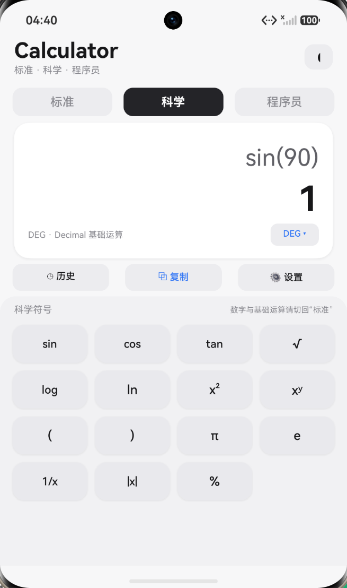

另外还实现了单独的 **程序员模式**。程序员模式使用 BigInt 处理整数，支持 BIN/OCT/DEC/HEX 四种进制、8/16/32/64 bit 位宽以及 AND、OR、XOR、NOT、移位、MOD 等运算；它和普通计算器使用不同工作区，因此在标准/科学与程序员之间切换时不会互相覆盖正在编辑的表达式。

除了简洁风格外，还加入了小猫和自定义两种外观。小猫模式沿用了前面实验中我家小猫“哈吉米”的素材，但没有重新修改计算逻辑，只改变页面配色和图片元素。

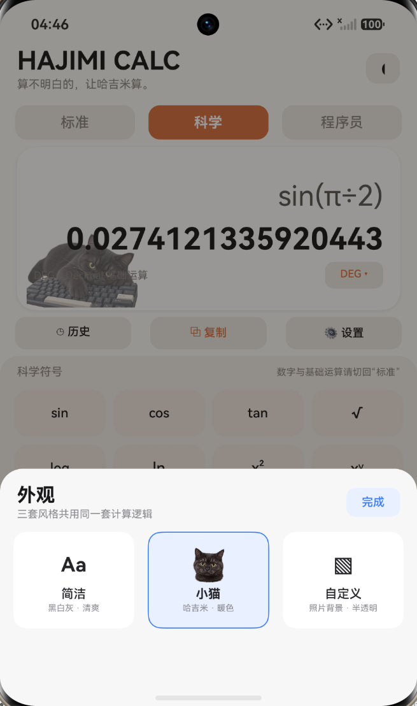

### 2. 配置 DevEco Studio 和 HarmonyOS 模拟器

本次实验在 Windows 系统下完成，使用 **DevEco Studio 26.0.0 Release**。由于我使用的 DevEco Studio 版本和课程截图中的版本不完全相同，部分菜单位置发生了变化。例如模拟器入口需要从欢迎页的“更多操作”中进入设备管理器。

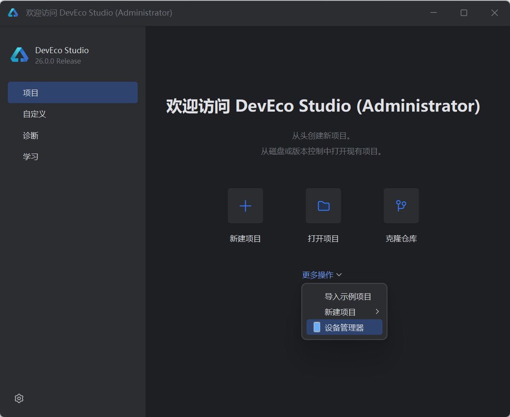

进入设备管理器后，开始时本地还没有模拟器，需要点击“新建模拟器”。

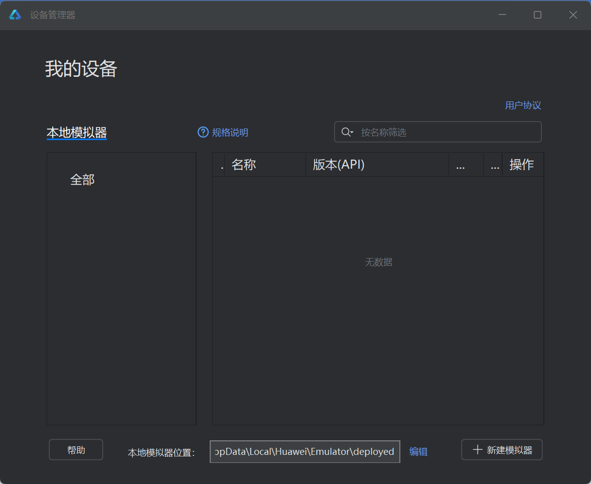

在设备类型中选择手机，并选择 HarmonyOS 7.0.0（API 26.0.0）的系统镜像。实验中使用的运行设备最终为 **Pura X View 7.0.0(26.0.0)**。

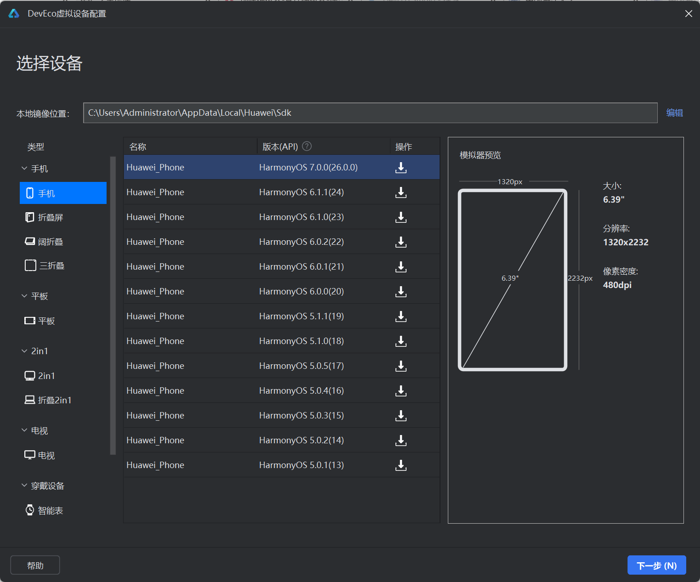

通过这一部分，我第一次完整配置了 HarmonyOS 的本地运行环境。和微信开发者工具类似，代码仍然是在电脑中编写，但最后会编译并安装到模拟出的 HarmonyOS 手机中运行。

### 3. 创建并运行第一个 HarmonyOS 应用

完成模拟器配置后，新建一个最基础的 HarmonyOS 工程。默认页面使用 ArkTS 编写，`Index.ets` 中有一个 `@State` 修饰的 `message` 变量，初始值为 `Hello World`，点击文字后会改成 `Welcome`。

```ts
@State message: string = 'Hello World';

.onClick(() => {
  this.message = 'Welcome';
})
```

对应代码如下：

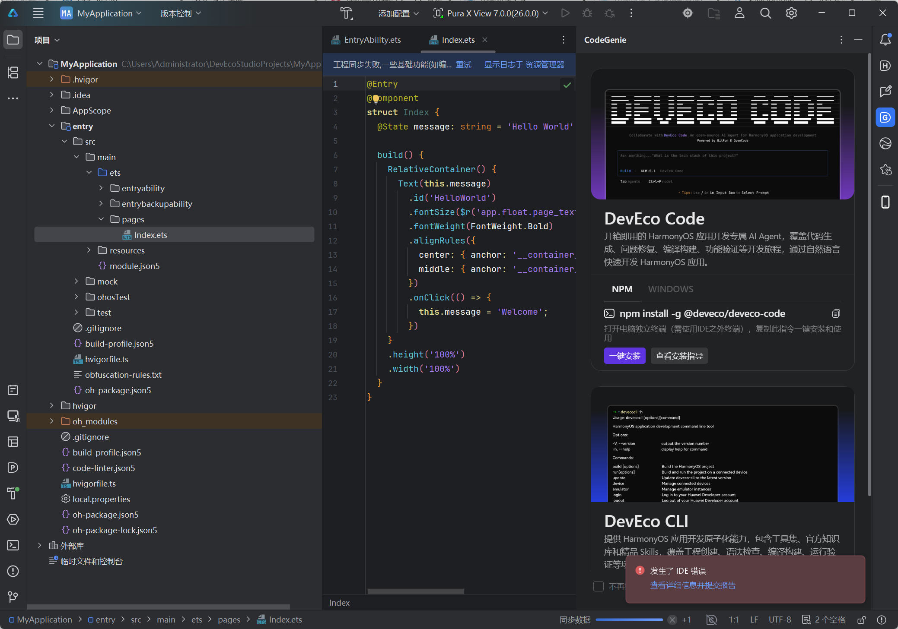

点击 Run 后，应用能够安装到模拟器并正常显示 `Hello World`。


点击页面文字以后，`message` 被修改为 `Welcome`，界面也会自动更新。


这个过程让我对 ArkUI 的状态更新有了比较直观的理解。`@State` 变量改变后，和它绑定的界面内容会一起更新，这和前面微信小程序中通过数据更新页面的思路有相似的地方，但写法和组件体系不同。

### 4. 导入并运行官方计算器项目

完成基础应用后，继续使用课程提供的 Calculator 示例。由于示例工程和我当前的 DevEco Studio 版本存在差异，第一次打开时 IDE 提示项目没有配置 `targetSdkVersion`。

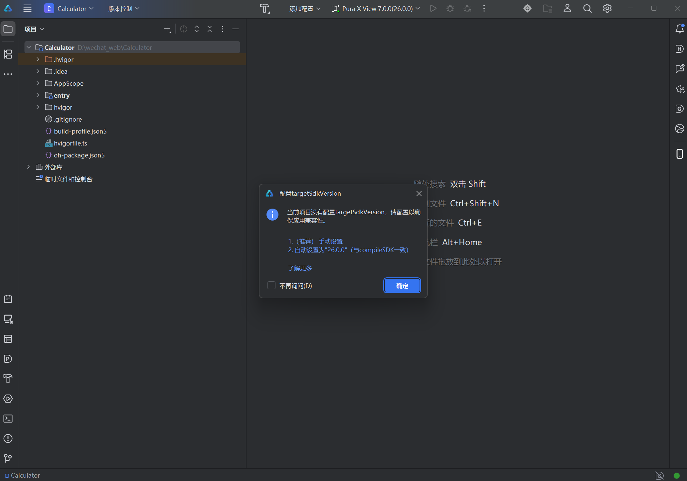

根据当前开发环境，将项目目标 SDK 设置为 26.0.0：

```json5
"compatibleSdkVersion": "6.0.0(20)",
"runtimeOS": "HarmonyOS",
"targetSdkVersion": "26.0.0"
```

重新同步工程后，Calculator 可以正常编译和运行。


为了确认原始模板没有问题，我先进行了几组最基本的测试，例如 `5+5=10`、`10×8=80`。


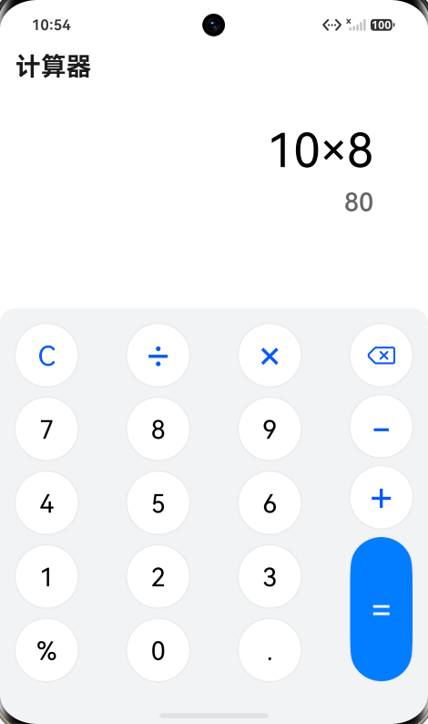

随后测试 `12+3×4`，结果为 24，说明原项目能够正确处理乘法优先于加法的运算顺序。

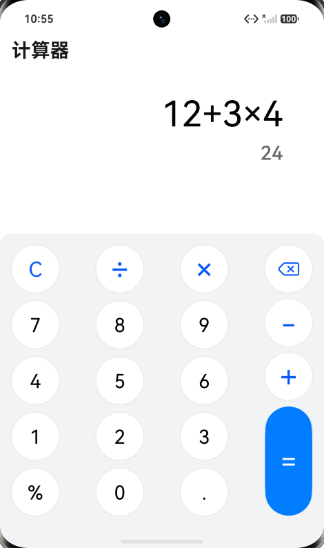

### 5. 在官方模板基础上增加三种计算方式

官方示例本身主要是普通四则计算。为了让程序不只是简单换颜色，我在它的基础上继续增加了 **标准、科学、程序员** 三种计算方式。三种模式并不是简单把按钮分成三页，而是根据不同使用场景分别处理：标准和科学共享同一个普通表达式工作区，程序员模式则单独保留自己的进制、位宽和整数表达式。

#### 5.1 标准模式

标准模式保留最常用的数字、四则运算、小数、百分号、正负号、清空、删除和等号。按键布局统一为 4 列，尽量保证在普通手机上一屏能够完整显示。输入过程中会实时计算当前合法表达式，正式按下 `=` 后再把这次计算加入历史记录。


#### 5.2 科学模式

科学模式不再重复放一套数字键，而是只展示标准模式中没有的科学符号。标准和科学共用同一份表达式，例如先在标准模式输入数字，再切换到科学模式插入 `sin`、`log`、π、根号等符号，之后仍然可以切回标准模式继续输入数字。这样可以避免科学页面因为重复数字键而过长。

主要科学按键定义如下：

```ts
static readonly SCIENTIFIC_KEYS: Array<string> = [
  'sin', 'cos', 'tan', '√',
  'log', 'ln', 'x²', 'xʸ',
  '(', ')', 'π', 'e',
  '1/x', '|x|', '%'
];
```

#### 5.3 程序员模式

程序员模式是这次扩展中比较偏计算机专业的一部分。它并不是把一个十进制结果再显示成二进制或十六进制，而是可以直接按照当前进制输入和进行运算。程序内部单独保存一份程序员工作区，并使用 `BigInt` 处理整数，避免较大的整数过早进入普通 `Number` 后产生精度问题。

目前支持的主要内容包括：

1. **4 种进制：** BIN（二进制）、OCT（八进制）、DEC（十进制）、HEX（十六进制）；

2. **4 种位宽：** 8 bit、16 bit、32 bit、64 bit；

3. **基础整数运算：** `+`、`-`、`×`、`÷`、`MOD`；

4. **位运算：** `AND`、`OR`、`XOR`、`NOT`、`<<`、`>>`；

5. **按进制限制输入：** BIN 只允许 `0/1`，OCT 只允许 `0~7`，HEX 才启用 `A~F`；

6. **进制切换：** 当前表达式能够求值时，切换进制会把当前值换算到新的进制继续显示和使用。

例如十六进制下：

```text
FF + A = 109
```

这里 `FF₁₆ = 255`，`A₁₆ = 10`，相加得到十进制 265，再以十六进制显示就是 `109₁₆`。二进制位运算也可以直接写成：

```text
1010 AND 1100 = 1000
```

程序员模式的核心求值入口保持为独立引擎：

```ts
ProgrammerEngine.evaluate(expression, radix, bitWidth)
```

这样标准/科学模式的十进制与科学函数计算不会和程序员模式的 BigInt、进制和位运算混在一起。进制和位宽本身属于低频设置，因此界面上只保留较小的入口，需要时再展开选择，尽量减少页面拥挤和滚动。

### 6. 特殊处理：科学计算与 DEG / RAD

科学模式中加入了 DEG 和 RAD 两种角度方式。最开始测试时我也专门比较了相同表达式在两种角度制下的结果。

例如在 DEG 模式下：

```text
sin(90°) = 1
```


切换到 RAD 后，同样的 `sin(90)` 会按照 90 弧度进行计算，因此结果不再是 1。

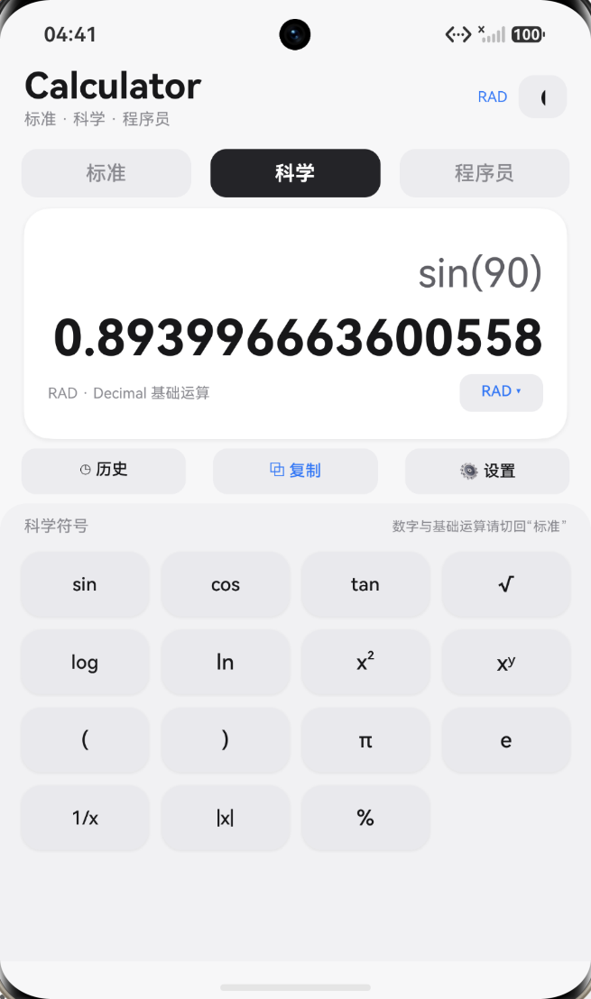

`log(10)` 也可以正常得到 1：

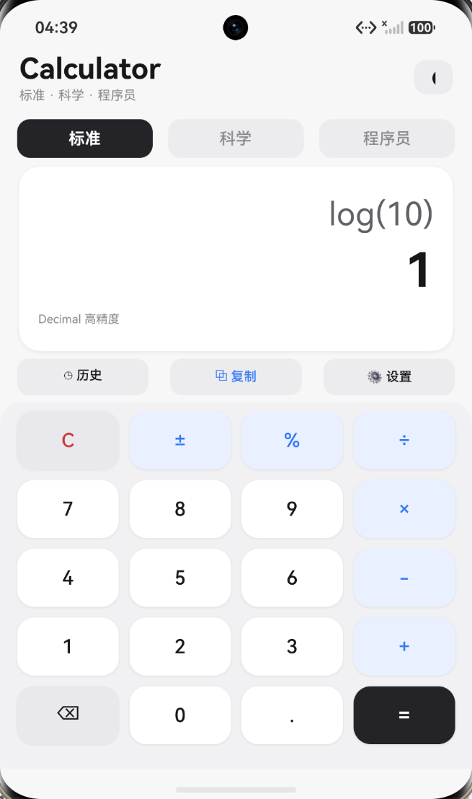

在输入不完整或者无法正常解析时，不再把结果错误显示成 0，而是显示 `NaN`，并在下方给出原因。例如 `log()` 没有参数时会提示当前输入无法识别。

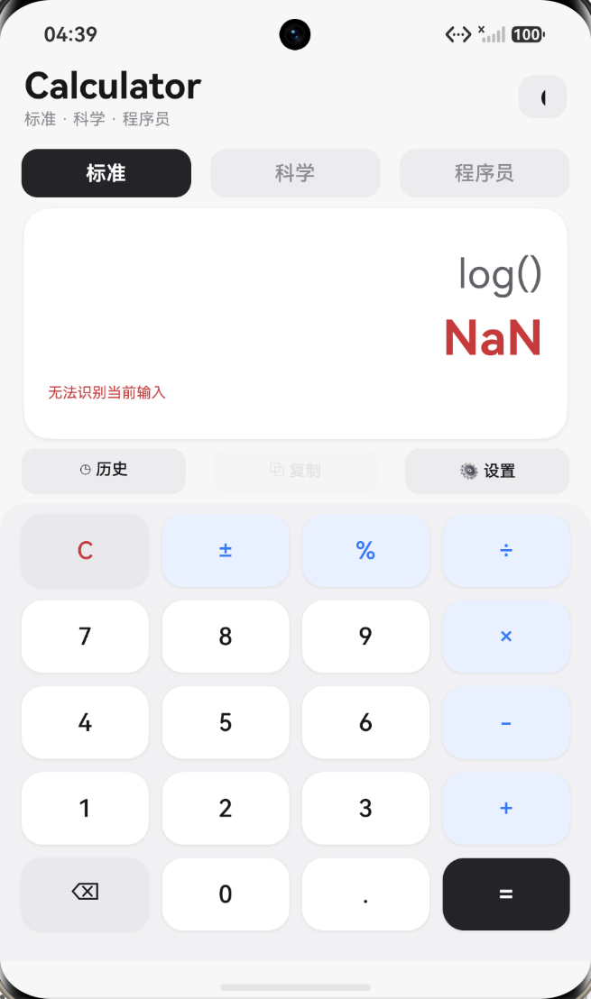

### 7. 特殊处理：高精度计算与结果显示

标准和科学模式提供两种精度方式：**高精度 Decimal** 和 **标准 Number**。高精度模式主要用于基础十进制四则运算，科学函数仍然使用对应的数学函数能力，没有简单地把所有科学函数都说成 50 位高精度。

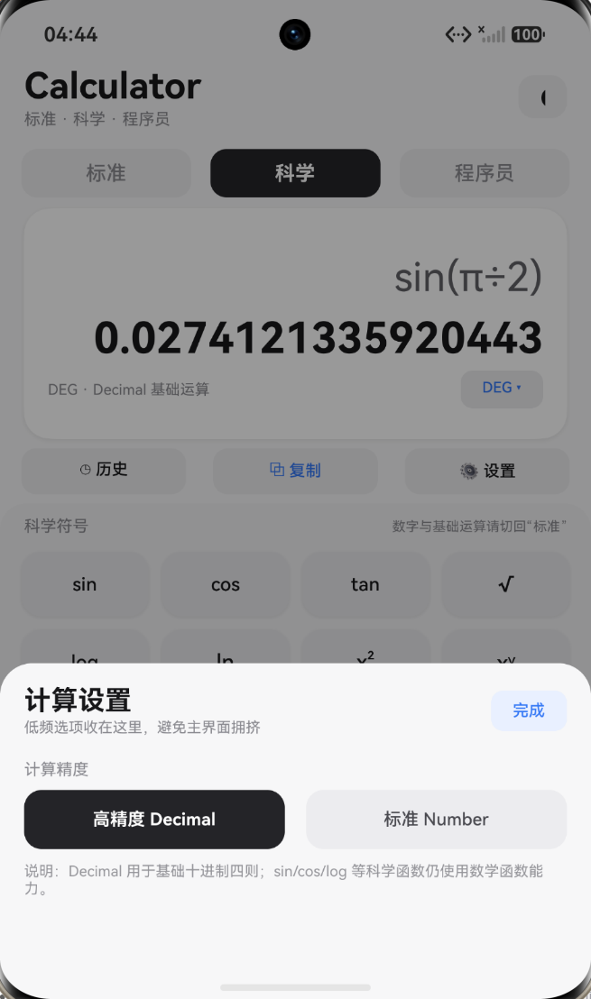

也可以切换回普通 `Number` 进行对比。

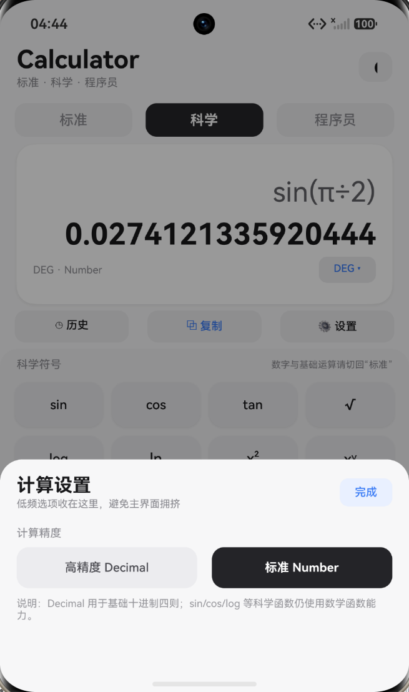

后续调试中还发现，当计算结果特别大时，如果直接把完整数字塞进一行，界面会出现截断。最终增加了单独的 `NumberFormatter`，计算结果和历史记录继续保存为 **string**，只有显示时才根据数量级决定是否转换成科学计数法。

```ts
if (exponent >= 12) {
  // 大数使用科学计数法显示
}

if (exponent <= -9) {
  // 很小的非零数使用科学计数法显示
}
```

这样可以避免为了 UI 显示先把高精度结果随意转换成普通 `Number`，同时也防止结果太长把界面撑开。

### 8. 表达式编辑、历史记录与结果复制

#### 8.1 表达式编辑和删除

在原始计算器中，输入主要是不断向表达式末尾追加内容。后续我把表达式区域改成 `TextInput`，并使用 `TextInputController` 保存光标和选区。

核心思路是：

```ts
.onTextSelectionChange((start: number, end: number) => {
  this.normalSelectionStart = start;
  this.normalSelectionEnd = end;
})
```

然后所有数字和符号都不再直接执行 `expression += value`，而是交给 `ExpressionEditor` 根据当前光标位置插入。删除键也按照同样思路工作：如果有选区就删除选区，没有选区就删除光标前一个字符。这样修改较长表达式时，不需要把后面的内容全部删掉再重新输入。

#### 8.2 历史记录与历史恢复

历史记录不是简单把结果写在一个数组中。每次正式按下 `=` 并完成一次合法计算后，程序才新增一条历史记录，最多保存最近 **50 条**，并使用 HarmonyOS `Preferences` 将历史序列化为 JSON 字符串保存在本地。因此关闭应用再重新打开后，之前的计算记录仍然能够读取。

每一条历史除了表达式和结果，还会记录当时的计算环境，例如：

```text
mode            标准 / 科学 / 程序员
expression      原表达式
result          原始结果字符串
precisionMode   Number / Decimal
angleMode       DEG / RAD
radix           BIN / OCT / DEC / HEX
bitWidth        8 / 16 / 32 / 64 bit
createdAt       计算时间
```

点击历史记录时，不只是把结果复制回来，而是调用恢复逻辑，将对应的表达式和相关环境一起恢复。例如点击一条 `sin(30)` 的科学计算记录，可以回到对应的科学模式和角度设置；点击程序员记录时，则会恢复对应进制和位宽。

核心保存与恢复逻辑可以概括为：

```ts
this.historyItems = updated;
this.service.saveHistory(this.historyItems);

// 点击历史后恢复模式、表达式以及相关设置
this.restoreHistory(item);
```

我特意让本地写入只发生在一次计算真正提交之后，而不是每输入一个数字就写入一次，这样可以减少没有必要的磁盘 I/O，对运行流畅度也更友好。

#### 8.3 结果复制

主界面提供了独立的“复制”入口。计算得到合法结果以后，可以直接把当前结果写入 HarmonyOS 系统剪贴板，随后在其他应用中粘贴使用。复制完成后页面会给出“已复制”的反馈；如果当前结果为空或为 `NaN`，复制按钮不会把无效结果写入剪贴板。

复制部分使用系统 `pasteboard`：

```ts
let data = pasteboard.createData(
  pasteboard.MIMETYPE_TEXT_PLAIN,
  text
);
await pasteboard.getSystemPasteboard().setData(data);
```

这里复制的是程序内部保存的**真实结果字符串**。因此当页面为了适配屏幕把很大或很小的数显示成科学计数法时，计算数据本身仍按 string 管理，不会因为 UI 截断而直接丢掉原结果。这个功能虽然比较小，但实际使用时比只能在计算器页面里查看结果方便很多。

### 9. 界面与主题设计

在功能基本稳定以后，我又增加了三套外观：**简洁、小猫、自定义**。三套主题共用同一套计算逻辑，不因为换主题重新实现一份计算器。

点击设置中的外观选项后，可以看到三种风格入口：

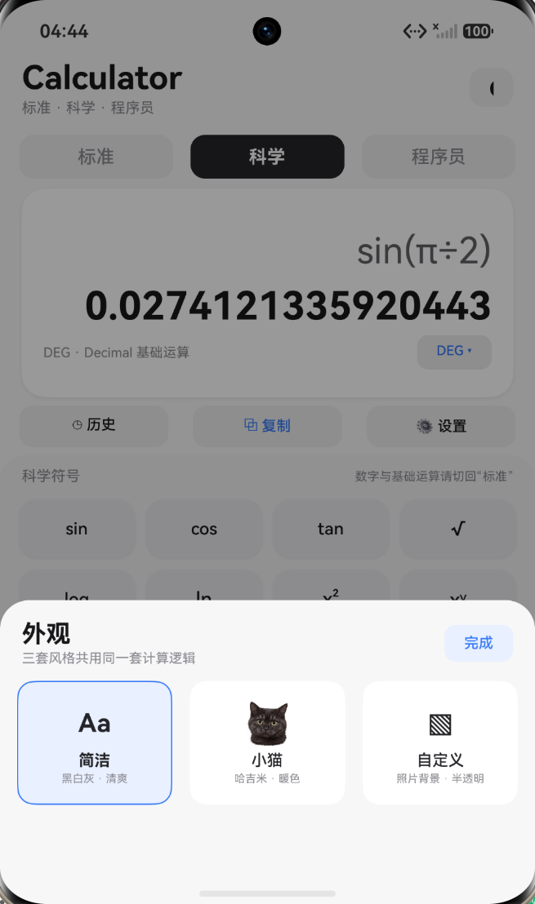

小猫模式使用了我家小猫“哈吉米”的图片，并把原来的蓝色强调改成暖色。为了避免图片太突兀，猫只作为结果区域的视觉元素，不参与计算逻辑。


自定义模式允许用户选择自己的背景图片，同时提供背景清晰度、遮罩、按钮不透明度和文字颜色设置。按钮可以保持一定透明度，让背景图片能够轻微透出来。

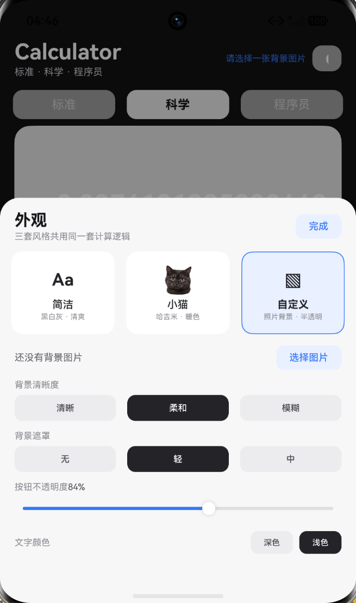

这一部分让我感觉，界面设计并不是把所有功能都直接放在首页。像精度、外观、进制和位宽这些低频设置收进弹层以后，主页面会清楚很多，也可以减少不必要的滚动。

## 二、问题总结与体会

### 1. DevEco Studio 版本和实验步骤不完全一致

实验一开始遇到的第一个问题并不是代码，而是我的 DevEco Studio 26.0.0 和课程截图界面不同。老师文档中的部分菜单在新版中位置发生了变化，例如设备管理器和 Run 入口都需要重新找。

后来我没有继续照着旧截图机械操作，而是根据当前 IDE 的实际界面找到设备管理器、配置 Pura X View 模拟器，并最终完成应用编译和运行。这让我意识到开发工具升级后，实验步骤可能不会完全一致，真正需要理解的是每一步要完成什么，而不是只记按钮位置。

### 2. 官方 Calculator 在新版本中的 SDK 兼容问题

导入 Calculator 示例后，DevEco Studio 提示缺少 `targetSdkVersion`。开始时我以为是项目同步失败，后来发现是旧示例工程和当前 API 26.0.0 配置不完全一致。

补充 `targetSdkVersion: "26.0.0"` 并重新同步后，项目可以正常运行。这部分让我对 `compatibleSdkVersion` 和 `targetSdkVersion` 的作用有了更实际的认识，也明白了导入旧工程时不能只看代码本身，还要看构建配置。

### 3. 数值精度和显示是两个问题

开发过程中一个比较明显的问题是，大数和高精度小数容易出现显示过长，而直接把所有内容转换成 `Number` 又可能损失精度。

最后将计算结果继续按 string 保存，把“真实结果”和“页面显示”分开处理。普通数正常显示，过大或过小的数再使用科学计数法。这种处理方式比简单截断字符串更合理。

### 4. 输入体验比我最开始想的复杂

普通计算器如果只能从最后删除，输入中间出错时会比较麻烦。因此后面尝试把表达式做成真正可编辑的输入区域，让数字和运算符可以根据光标位置插入和删除。

这一部分让我发现，一个看起来很普通的计算器，真正做起来并不只是“写一个加减乘除公式”。光标、选区、错误状态、等号行为、历史记录和模式切换都会影响实际使用体验。

### 6. 实验收获

相比前面几个微信小程序实验，本次实验第一次完整使用 DevEco Studio 和 ArkTS 开发 HarmonyOS 应用。从创建模拟器、运行 Hello World，到导入官方 Calculator，再到自己扩展计算逻辑和 UI，整个过程让我对 HarmonyOS 应用的工程结构和 ArkUI 状态更新有了初步认识。

我也发现，功能越多越不能把代码全部堆在一个页面里。当前项目将表达式编辑、普通/科学计算、程序员计算、数字格式化和本地服务分别拆开，页面主要负责状态显示和用户交互。这样后面继续修改某一部分时，不需要把整个计算器重新改一遍。

本次实验最终不只是完成了一个可以运行的基础计算器，还在原项目上增加了科学计算、程序员计算、高精度、历史持久化与恢复、结果复制、错误提示和多种外观。后续如果继续完善，我会优先保证现有功能稳定和运行流畅，再考虑增加新的扩展功能。
