# OUC Mobile Software Development

中国海洋大学 2026 夏《移动软件开发》课程实验与个人项目仓库。

本仓库用于记录课程实验代码、实验报告以及个人项目。课程实验使用独立 Git 分支管理；`main` 分支除课程导航外，目前也包含 **BUGTI Web** 及 GitHub Pages 部署配置。

---

## 🧪 BUGTI 暑期人格测试

> **当前版本：BUGTI Web 功能同步版 · 与仓库内微信小程序核心功能同步**

🌐 **在线体验：**  
https://qiqiqisi.github.io/ouc-mobile-software-development/

由于微信小程序发布需要审核，因此同时提供无需安装的测试网站。页面按手机优先设计，也兼容桌面浏览器；问题和建议可通过本仓库 [Issues](https://github.com/qiqiqisi/ouc-mobile-software-development/issues) 提交。

所有图片均由ChatGPT参考MBTI和SBTI风格生成。

BUGTI 是一个围绕“生活记录 + 阶段人格分析 + 监工陪学”设计的小项目。用户可以记录每天的状态，在积累记录后按自然日范围分析并获得 BUGTI 人格结果；也可以制作自己的监工、安排今日计划、拖动逗猫棒互动，并让监工陪自己完成一轮专注计时。

### ✨ 主要功能

- 📝 **每日记录**：记录心情、忙碌度、标签、文字和图片
- ✏️ **编辑与补记**：支持修改当天记录，也可以补记过去日期
- 🗑️ **记录删除**：可删除已有记录及对应本地图片
- 📅 **历史日历**：按月份查看记录日期和心情 Emoji
- 🧠 **人格分析**：支持最近 7 天、最近 30 天和自定义自然日范围
- 🎭 **BUGTI 人格结果**：根据记录生成对应人格、文案和人格图片
- ☁️ **本地记录词云**：只从真实记录提取关键词，支持横排、竖排和空状态；不会用人格结果反推词语
- 🔮 **今日运势**：每日抽取运势，并支持不同主题与变体
- 🐈 **我的监工**：从照片中涂抹保留头部，生成透明图片并穿上 BUGTI 小西装；名字支持 1～6 个可见字符，显示大小可调
- 🏠 **宠物天地**：最多保存 3 位监工，可切换主监工；监工会在房间巡视、回应点击、在桌边活动并追逐逗猫棒
- 🪄 **逗猫棒互动**：拖动玩具后，房间中的监工会追向当前位置，松手后恢复自由活动
- ✅ **今日计划**：每天最多添加 5 条计划，支持完成、取消完成、删除，并显示完成进度和累计专注数据
- ⏱️ **监工陪学**：可选择自由专注或绑定计划、选择监工，使用 25/50/90 分钟预设或 5～120 分钟自定义时长
- 🍅 **完整计时流程**：支持暂停、继续、提前结束、工作完成后的休息阶段、跳过休息、完成/中断统计，以及刷新后的计时恢复
- 🔗 **分享**：支持人格结果和运势分享链接
- 📱 **移动端优先**：适配常见手机宽度，同时兼容 PC 浏览器

### 📷 功能展示

| 首页与每日记录 | 人格结果与记录词云 |
| --- | --- |
| 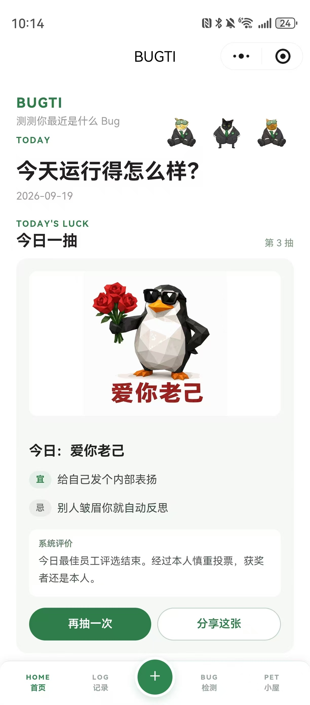 | 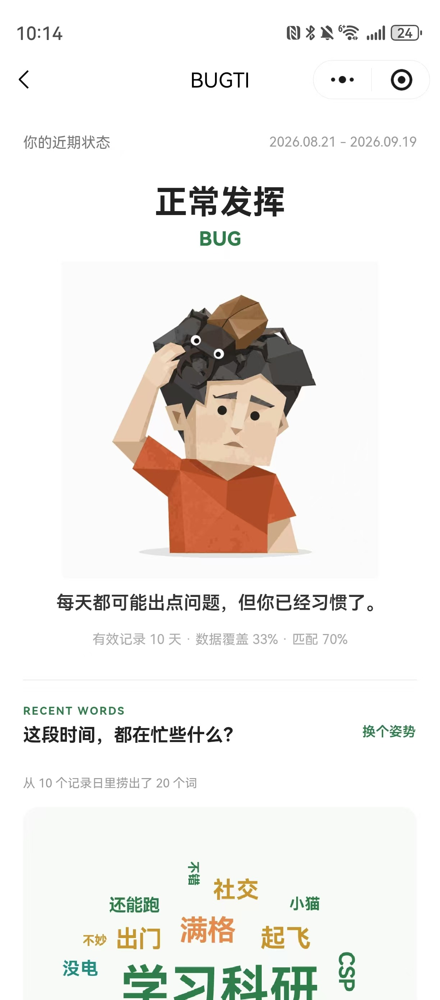 |
| 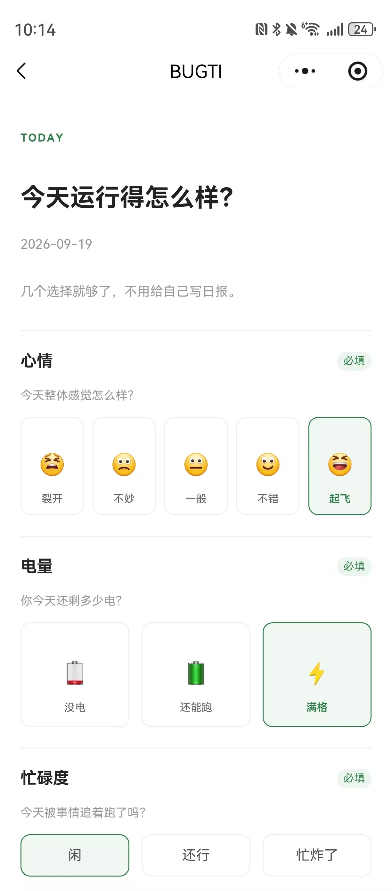 | 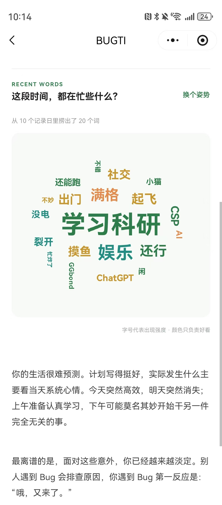 |

| 监工制作与管理 | 宠物天地互动 |
| --- | --- |
| 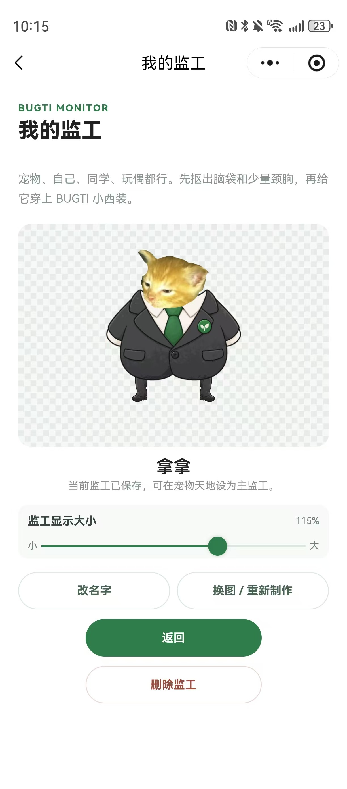 | 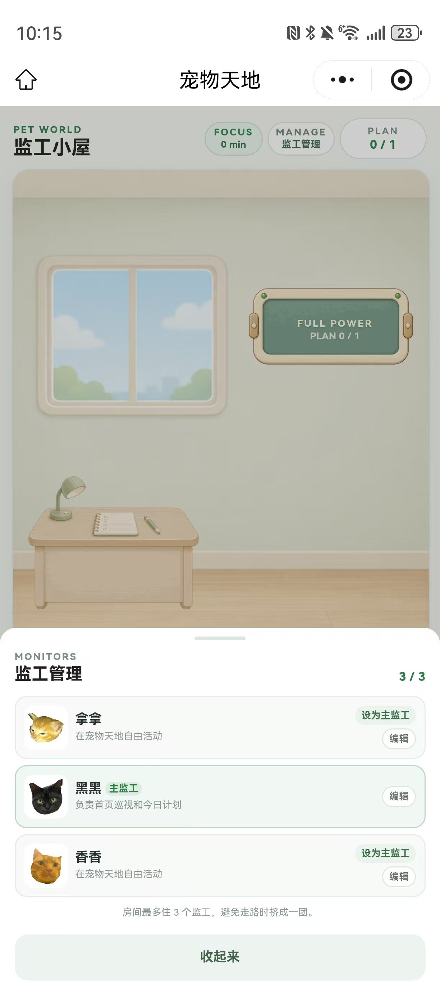 |
| 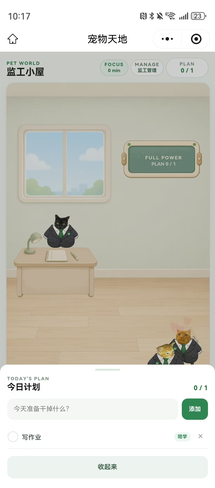 | 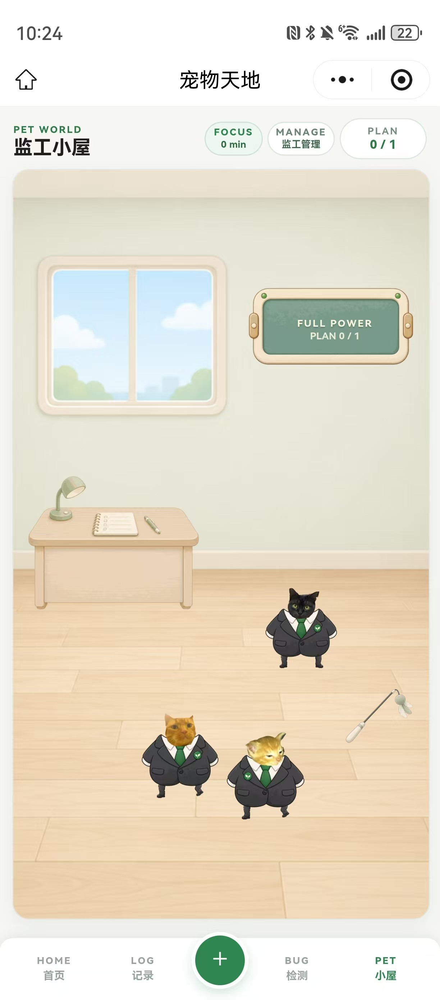 |

| 监工陪学设置 | 计时与结果 |
| --- | --- |
| 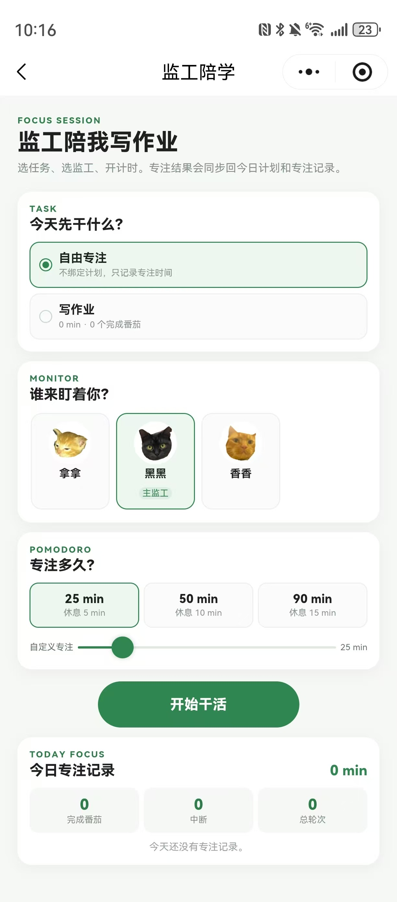 | 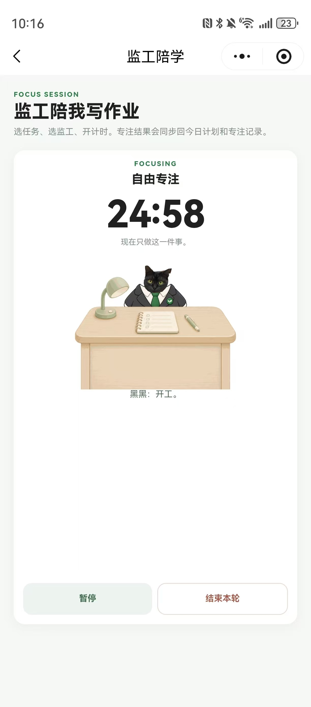 |
| 预设 25/50/90 分钟，也可自定义 5～120 分钟。 | 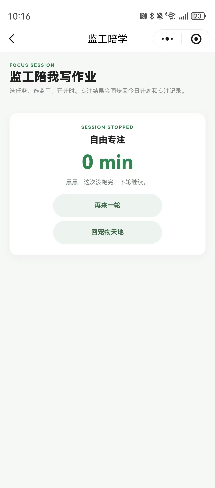 |

### 💾 数据存储说明

BUGTI Web **没有账号系统和云端同步**。记录、计划、计时状态和监工图片只保存在访问网站时所使用的浏览器本地。

当前主要存储方式：

- 每日记录：`localStorage`
- 人格分析报告：`localStorage`
- 今日运势状态：`localStorage`
- 今日计划与专注记录：`localStorage`
- 当前进行中的计时：`localStorage`
- 监工名单和主监工设置：`localStorage`
- 记录图片：`IndexedDB`
- 监工透明图片：`IndexedDB`

因此需要注意：

- 正常刷新网页、关闭后重新打开同一浏览器，数据通常仍会保留。
- **微信内置浏览器和 Chrome / Edge / Safari 等外部浏览器可能使用不同的本地存储环境。** 即使打开的是同一个网址，两边的记录也可能互相看不到。
- 更换浏览器、更换设备后，原来的记录不会自动同步过去。
- 清除浏览器网站数据、缓存或本地存储，可能导致记录和图片丢失。
- 清理微信相关网页数据后，从微信中保存的记录也可能丢失。
- 无痕 / 隐私浏览模式下的数据不建议长期保存。
- 当前版本没有云端备份，请不要把重要资料只保存在 BUGTI 中。

### 🔐 公开仓库内容边界

| 可以公开 | 不应公开 |
| --- | --- |
| 小程序与 Web 源码、无身份信息的功能截图、项目说明、通用配置、GitHub Actions 工作流 | 真实微信 APPID、`project.private.config.json`、Access Token、云环境 ID、私钥、密码、个人姓名/学号/手机号、聊天截图、带定位或身份元数据的图片 |

公开版 `project.config.json` 使用 `touristappid`；真实 APPID 仅保存在被 `.gitignore` 排除的本机 `project.private.config.json`。用户照片和抠图结果由浏览器本地处理，不会由 BUGTI Web 上传到服务器。

### 📦 版本与验证说明

当前同步版包含记录、分析、人格结果、词云、今日运势、监工制作、宠物天地、逗猫棒、今日计划和监工陪学。Web 使用原生 HTML、CSS 和 JavaScript，无需构建；GitHub Pages 发布 `web/` 目录。

本次整理完成的自动检查包括：25 个 Web JavaScript 文件语法检查、203 组小程序/Web 分析器一致性输入、计划与专注存储逻辑、73 个本地 HTTP 资源可访问性检查。自动检查不能代替微信真机测试。

浏览器和微信小程序的平台外壳并不相同，因此系统相册选择、系统分享面板、微信导航栏以及真机触控手感不可能做到像素级完全一致；这些能力仍建议在真实手机上人工验收。业务页面、分析规则和本地数据流程以仓库代码为准。

后续版本会继续根据实际使用情况修复问题和调整体验。

---

## 📌 其他实验进度

| 实验   | 内容             | 分支                                                         | 状态     |
| ------ | ---------------- | ------------------------------------------------------------ | -------- |
| Lab 01 | 第一个微信小程序 | [lab01](https://github.com/qiqiqisi/ouc-mobile-software-development/tree/lab01) | ✅ 已完成 |
| Lab 02 | 名片小程序       | [lab02](https://github.com/qiqiqisi/ouc-mobile-software-development/tree/lab02) | ✅ 已完成 |
| Lab 03 | 高校新闻网       | [lab03](https://github.com/qiqiqisi/ouc-mobile-software-development/tree/lab03) | ✅ 已完成 |
| Lab 04 | 推箱子：哈吉米推什么推 | [lab04](https://github.com/qiqiqisi/ouc-mobile-software-development/tree/lab04) | ✅ 已完成 |
| Lab 05 | 鸿蒙开发入门及计算器开发 | [lab05](https://github.com/qiqiqisi/ouc-mobile-software-development/tree/lab05) | ✅ 已完成 |
| Lab 06 | 海大圈校园图文社区 | [lab06](https://github.com/qiqiqisi/ouc-mobile-software-development/tree/lab06) | ✅ 已完成 |

---

## Lab 01：第一个微信小程序

实验 1 主要用于熟悉微信小程序的基本结构和开发流程。

主要完成：

- 使用官方 JS 基础模板创建小程序
- 使用 WXML 编写页面结构
- 使用 WXSS 设置页面样式
- 使用 JavaScript 管理页面数据
- 使用 `bindtap` 绑定点击事件
- 使用 `setData()` 更新页面
- 实现按钮点击次数统计
- 不使用模板重新创建一个简单小程序
- 使用 `flag` 实现 `Hello World` 与 `Hello WeChat` 的反复切换

👉 [查看 Lab 01 分支](https://github.com/qiqiqisi/ouc-mobile-software-development/tree/lab01)

进入分支后可以直接查看实验代码和完整实验报告。

---

## Lab 02：名片小程序

实验 2 完成了一个个人微信小程序名片。

主要完成：

- AI 生成 16:9 个人名片头图
- 使用 WXML 和 WXSS 完成个人名片页面
- 添加个人介绍和关键词词云
- 展示个人学习信息
- 展示 GitHub 项目经历
- 使用 `data-url` 传递项目链接
- 使用 `wx.setClipboardData()` 实现 GitHub 链接复制
- 使用 `wx.showToast()` 提示复制结果
- 使用 `open-type="share"` 和 `onShareAppMessage()` 实现微信分享

👉 [查看 Lab 02 分支](https://github.com/qiqiqisi/ouc-mobile-software-development/tree/lab02)

进入分支后可以直接查看小程序源码、实验截图和完整实验报告。

---

## Lab 03：高校新闻网

实验 3 完成了一个中国海洋大学校园新闻网小程序，并在基础实验要求上继续增加了一些实际使用功能。

主要完成：

- 使用中国海洋大学近期官方新闻替换 Demo 中的旧新闻数据
- 首页使用轮播图展示重点新闻，并展示新闻列表
- 支持新闻标题、作者和正文内容搜索
- 支持“全部 / 海大要闻 / 综合新闻”分类筛选
- 点击新闻进入详情页，展示完整正文、图片和图注
- 首页、详情页和最近阅读均支持星标收藏，并保持收藏状态同步
- 使用微信小程序 Storage 保存收藏、最近阅读和个人资料
- 收藏与最近阅读支持左滑单条删除、批量删除、全选和一键清空
- 最近阅读记录最后阅读时间，并支持快捷收藏
- 支持微信头像昵称填写、资料修改和本地快捷恢复登录
- 使用 `open-type="share"` 和 `onShareAppMessage()` 实现新闻分享
- 使用 AI 辅助编写 Python 脚本，整理海大官方新闻正文和图片数据

👉 [查看 Lab 03 分支](https://github.com/qiqiqisi/ouc-mobile-software-development/tree/lab03)

进入分支后可以直接查看最终小程序源码、实验截图和完整实验报告。

---

## Lab 04：哈吉米推什么推

实验 4 完成了一个以黑猫“哈吉米”为主题的推箱子小程序，并在基础推箱子功能上进行了个性化设计。

主要完成：

- 使用 8×8 二维数组保存四个关卡
- 使用 Canvas 2D 绘制游戏地图
- 将玩家、箱子、目标和墙体分别替换为哈吉米、猫罐头、猫饭碗和快递纸箱
- 支持方向按钮和棋盘滑动操作
- 统计步数与推动次数
- 支持撤回和重新开始
- 使用微信小程序 Storage 保存每关本地最佳成绩
- 通关后显示理论最少步数，并可查看“标准作案路线”

👉 [查看 Lab 04 分支](https://github.com/qiqiqisi/ouc-mobile-software-development/tree/lab04)

进入分支后可以直接查看最终小程序源码、实验截图和完整实验报告。

---

## Lab 05：鸿蒙开发入门及计算器开发

实验 5 使用 DevEco Studio、ArkTS 和 HarmonyOS 完成了一个支持多种计算方式的 Calculator 应用。

主要完成：

- 支持标准、科学和程序员三种计算模式
- 科学模式提供三角函数、对数、幂、根号、括号、π、e 以及 DEG / RAD 角度方式
- 使用 Decimal 完成高精度基础十进制计算，并保留 Number 标准精度模式
- 程序员模式使用 BigInt，支持 BIN / OCT / DEC / HEX 进制、位宽与位运算
- 支持在光标位置编辑表达式和删除内容
- 保存正式计算的历史记录，并恢复对应模式、表达式和相关设置
- 使用 HarmonyOS 系统剪贴板复制真实结果字符串
- 提供简洁、小猫和自定义三套外观

👉 [查看 Lab 05 分支](https://github.com/qiqiqisi/ouc-mobile-software-development/tree/lab05)

进入分支后可以直接查看最终 HarmonyOS 工程、实验截图和完整实验报告。

---

## Lab 06：海大圈

实验 6 基于微信云开发完成了一个校园图文社区“海大圈”，围绕校园笔记发布、互动和个人主页实现完整的数据闭环。

主要完成：

- 首页采用双列校园图文信息流，支持分类筛选、分页和下拉刷新
- 支持发布 0～3 张图片，并设置多图封面、地点和联系方式
- 详情页支持多图、评论、回复、点赞、收藏、关注、分享和保存图片
- 使用 `cloud.getWXContext()` 获取 `OPENID` 作为当前微信用户身份
- 使用 `login`、`campusApi` 云函数统一处理身份和业务逻辑
- 使用 `users`、`posts`、`post_reactions`、`follows`、`comments`、`browse_history` 六个云数据库集合
- 支持个人主页、TA 主页、关注与粉丝列表、资料编辑
- 支持浏览历史、状态筛选以及单条移除和清空
- 使用事务、唯一关系 ID 和请求 ID 处理幂等、计数一致性和失败回滚
- 项目自带 39 项自动测试和静态检查

👉 [查看 Lab 06 分支](https://github.com/qiqiqisi/ouc-mobile-software-development/tree/lab06)

进入分支后可以直接查看最终小程序源码、云函数、实验截图和完整实验报告。

---

## 🌿 仓库与分支管理

课程实验仍采用一个实验对应一个分支的方式管理；个人项目 BUGTI Web 当前位于 `main` 分支的 `web/` 目录，并通过 GitHub Actions 部署到 GitHub Pages。

```text
main
│
├── README.md
├── web/
├── .github/
│   └── workflows/
└── ...

lab01
│
├── README.md
├── images/
├── first_test/
├── second_test/
└── .gitignore

lab02
│
├── README.md
├── images/
├── card/
└── .gitignore

lab03
│
├── README.md
├── images/
├── lab03_complete/
└── .gitignore

lab04
│
├── README.md
├── images/
├── assets/
├── data/
├── pages/
├── utils/
└── .gitignore

lab05
│
├── README.md
├── images/
├── AppScope/
├── entry/
├── hvigor/
└── .gitignore

lab06
│
├── README.md
├── images/
├── assets/
├── cloudfunctions/
├── components/
├── pages/
├── services/
└── .gitignore
```
