# 实验 6：海大圈——基于微信云开发的校园图文社区

## 一、实验环境

| 环境/技术 | 使用情况 |
| --- | --- |
| 开发平台 | 微信开发者工具 |
| 小程序框架 | 微信小程序原生 JS / WXML / WXSS |
| 云能力 | 微信云开发 |
| 用户身份 | `cloud.getWXContext()` 获取 `OPENID` |
| 数据库 | 云数据库，共 6 个集合 |
| 文件存储 | 微信云存储 |
| 后端逻辑 | `login`、`campusApi` 云函数 |
| 本地测试 | Node.js `node:test` |
| 主题色 | 海大蓝 `#1980C8` |

---

## 二、项目设计思路

### 1. 从“实验功能”扩展为“校园社区”

为了避免仅完成单一的云数据库增删改查，本实验把云开发能力放入一个完整的校园社区场景中。项目核心流程为：

```text
微信当前用户
    ↓
云函数获取 OPENID
    ↓
首页浏览校园笔记
    ↓
发布 / 查看详情
    ↓
点赞 · 收藏 · 评论 · 回复 · 关注
    ↓
个人主页 / 收藏 / 点赞 / 浏览历史
    ↓
云数据库持久化
```

首页提供“最新、跑腿、选课、失物、风景、其他”六个入口。内容页参考移动端图文社区的信息层级，采用“作者信息 → 图片 → 标题与正文 → 评论 → 底部互动栏”的布局；但整体配色、Logo、校园话题和文案仍保持“海大圈”的独立风格。

### 2. 页面结构

本项目共实现 8 个页面：

| 页面 | 主要功能 |
| --- | --- |
| `pages/index` | 首页双列信息流、分类筛选、分页、下拉刷新 |
| `pages/publish` | 发布笔记、0～3 张图片、多图封面、地点与联系方式 |
| `pages/detail` | 图片轮播、评论、回复、点赞、收藏、关注、分享、保存图片 |
| `pages/profile` | 我的资料、笔记 / 收藏 / 点赞、状态筛选、浏览历史入口 |
| `pages/user` | TA 的公开主页、公开笔记与关注操作 |
| `pages/profile-edit` | 头像、昵称编辑 |
| `pages/history` | 浏览记录、日期分组、单条移除、清空 |
| `pages/relations` | 关注列表、粉丝列表及关注状态切换 |

此外，项目将重复 UI 抽成 `post-card`、`ouc-icon` 组件，并使用自定义 TabBar 统一“首页 / 发布 / 我的”三个主入口。

---

## 三、云开发与数据设计

### 1. 当前微信身份登录

项目没有额外设计账号密码登录页，而是在小程序启动时初始化云开发，并调用 `login` 云函数。云函数通过 `cloud.getWXContext()` 获取当前微信身份：

```js
exports.main = async () => {
  const { OPENID } = cloud.getWXContext()
  if (!OPENID) {
    throw new Error('OPENID unavailable')
  }

  // 已有用户直接读取；首次进入时创建默认用户资料
  // ...

  return {
    openid: OPENID,
    user
  }
}
```

这种方式避免客户端自行提交用户 ID。后续所有点赞、收藏、评论、关注和历史记录，都以云函数上下文中的 `OPENID` 为准。

### 2. 服务层与云函数分离

前端页面不直接操作数据库，而是统一通过 `services/api.js` 调用 `campusApi`：

```js
function call(action, data = {}) {
  return wx.cloud.callFunction({
    name: 'campusApi',
    data: { action, ...data }
  }).then(res => {
    const result = res && res.result
    if (!result || result.ok !== true) {
      throw new Error((result && result.message) || '云端请求失败')
    }
    return result.data
  })
}
```

这样页面只负责交互，云函数负责权限、事务和数据一致性，结构比把数据库调用散落在页面中更清晰。

### 3. 云数据库集合

项目最终使用 6 个集合：

| 集合 | 作用 |
| --- | --- |
| `users` | 用户昵称、头像、关注数、粉丝数、收到的赞与收藏 |
| `posts` | 帖子正文、分类、图片、作者快照及互动计数 |
| `post_reactions` | 用户与帖子的点赞 / 收藏关系 |
| `follows` | 用户之间的关注关系 |
| `comments` | 评论、回复关系与评论作者快照 |
| `browse_history` | 每个用户最近浏览的帖子 |

数据库控制台中可以看到以上集合，浏览记录中保存 `openid`、`postId` 与最近访问时间：

<p align="center">
  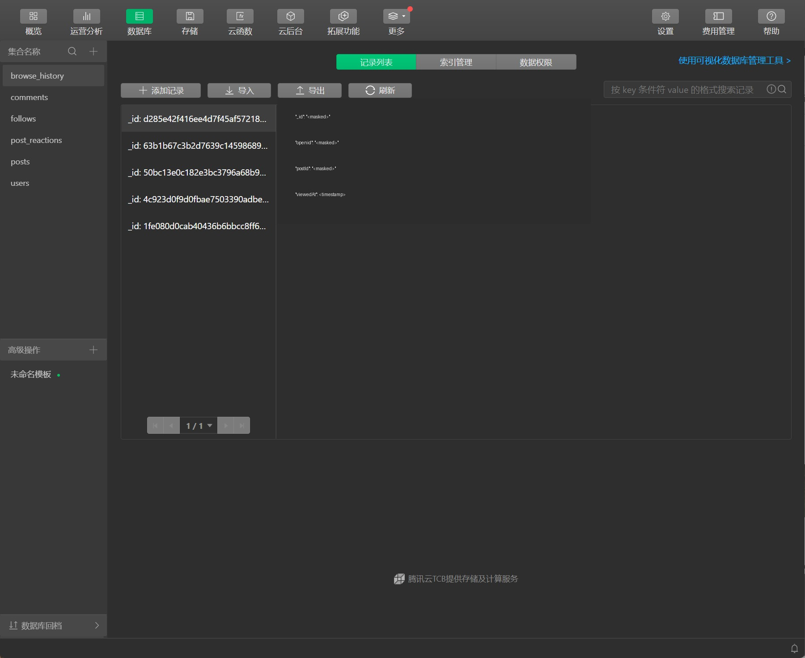

> 报告中的数据库截图对具体标识值进行了遮挡，仅保留集合与字段结构。

---

## 四、核心功能实现

### 1. 首页：双列信息流、分类与分页

首页采用双列图文卡片，将校园内容按“最新、跑腿、选课、失物、风景、其他”分类。帖子卡片展示封面、标题、作者和点赞状态；支持下拉刷新和触底分页。

为避免用户快速切换分类时“旧请求晚返回，反而覆盖新分类”的问题，分页工具使用请求序号：

```js
const token = (host._loadToken || 0) + 1
host._loadToken = token

const result = await fetchPage(page)
if (host._loadToken !== token || host._gone) return
```

这样只有最新请求可以更新页面。

<p align="center">
  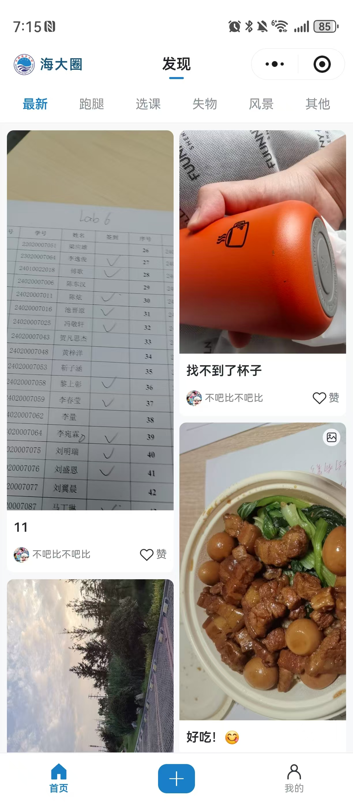
  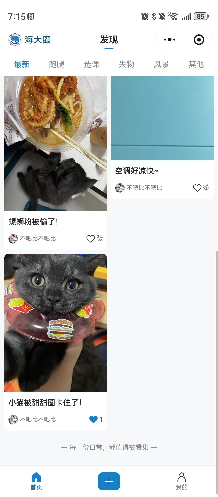
  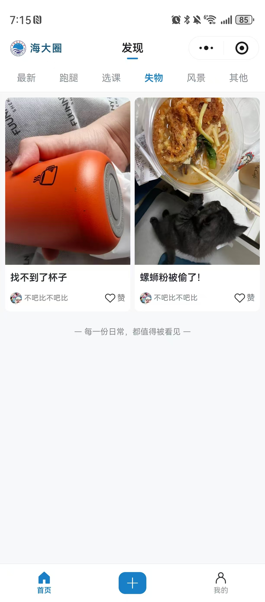
</p>

### 2. 发布：图片、封面与分类校验

发布页允许添加 0～3 张图片。风景类笔记至少需要 1 张图片；只有一张图片时自动设为封面，多图时可以主动选择封面。

```js
if (category === 'scenery' && images.length === 0) {
  return '风景帖至少需要1张图片'
}
if (images.length > 0 && (coverIndex === null || !images[coverIndex])) {
  return '请选择一张图片作为封面'
}
```

发布时还会固定当前草稿快照，避免上传过程中用户继续修改内容导致封面索引与图片错位。

<p align="center">
  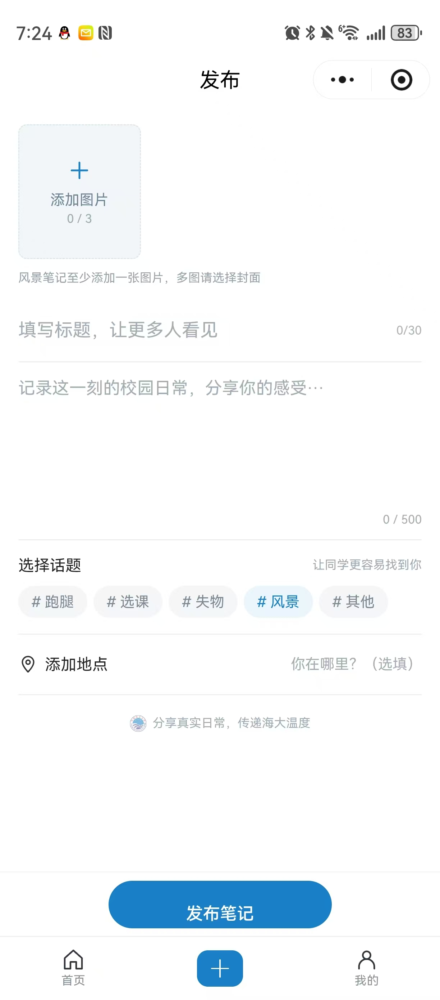
  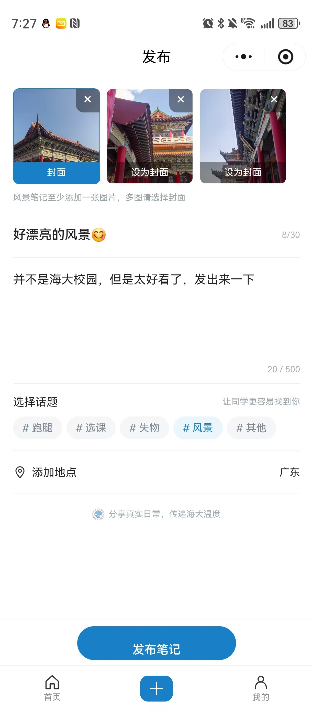
</p>

除了标题、正文和分类，还可以填写地点；跑腿和失物分类可选填联系方式。

### 3. 详情页：图片、正文和帖子状态

详情页支持多图轮播、全屏预览、保存到系统相册和微信分享。对于“跑腿”和“失物”两类帖子，作者可以在问题完成后将状态更新为“已解决”或“已找到”。

<p align="center">
  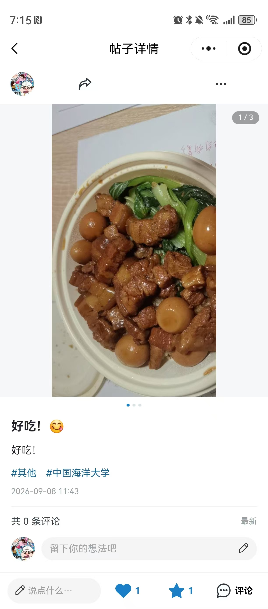
  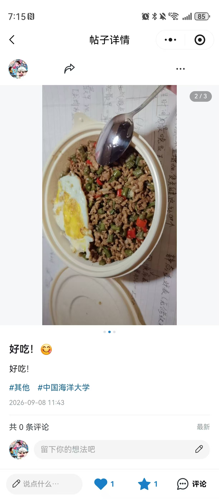
  
</p>

<p align="center">
  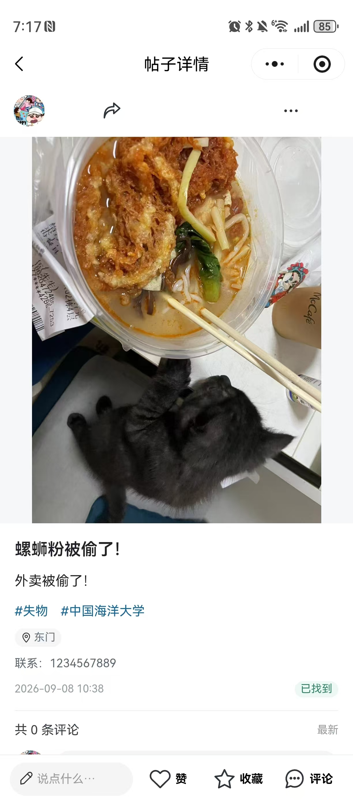
  
  
</p>

<p align="center">
  
</p>

### 4. 点赞与收藏：幂等关系 + 事务计数

点赞和收藏并不是简单地直接 `likeCount++`。项目为“用户 + 帖子 + 类型”生成确定的关系 ID，并由数据库事务同时维护关系表和计数字段。

```js
const delta = Number(active) - Number(Boolean(existing))

if (delta) {
  if (active) {
    await ref.set({ data: { openid, postId, type, createdAt: Date.now() } })
  } else {
    await ref.remove()
  }

  await tx.collection('posts').doc(postId).update({
    data: { [field]: next }
  })
}
```

客户端采用“先反馈、失败再回滚”的交互方式，同时给每个控件加锁，避免连续快速点击产生多次请求。

这套设计的优点是：

- 重复请求不会重复计数；
- 取消点赞不会出现负数；
- 点赞与收藏关系彼此独立；
- 服务端失败时页面可以恢复原状态。

### 5. 评论与回复：失败保留草稿、请求 ID 去重

详情页支持发表评论、回复已有评论和删除自己的评论。发送失败时草稿不会被清空；用户重试同一条内容时复用 `requestId`，服务端以确定的评论文档 ID 保证幂等。

<p align="center">
  
</p>

核心逻辑如下：

```js
if (!this._commentRequest || this._commentRequest.signature !== signature) {
  this._commentRequest = {
    signature,
    id: `${Date.now()}_${Math.random().toString(36).slice(2, 12)}`
  }
}
```

云函数再次校验 `requestId`，并在事务中判断同一请求是否已经存在，从而避免网络重试造成重复评论和重复累计评论数。

### 6. 用户主页、我的页面与资料编辑

“我的”页面展示头像、昵称、关注数、粉丝数以及“获赞与收藏”统计，同时提供“笔记 / 收藏 / 点赞”三个内容标签。本人还可以根据“进行中”和“已解决 / 找到”筛选自己发布的帖子。

TA 的主页只展示公开信息和公开帖子；收藏、点赞列表和浏览历史不会暴露给其他用户。

<p align="center">
  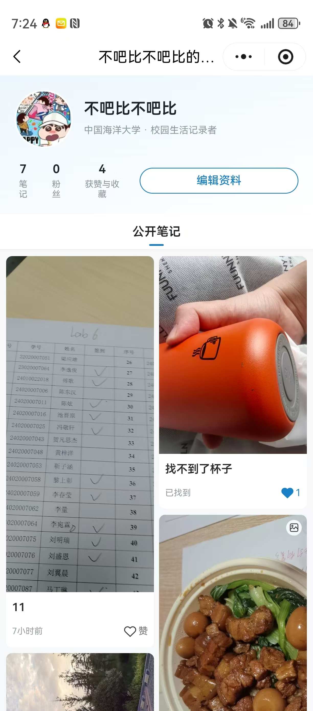
  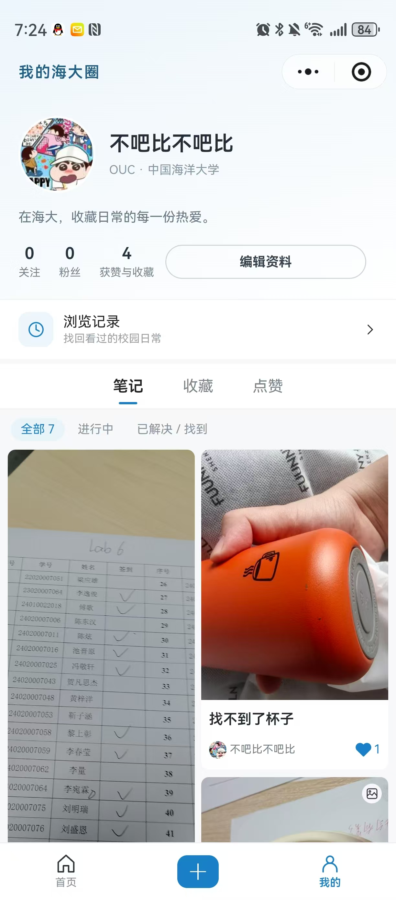
  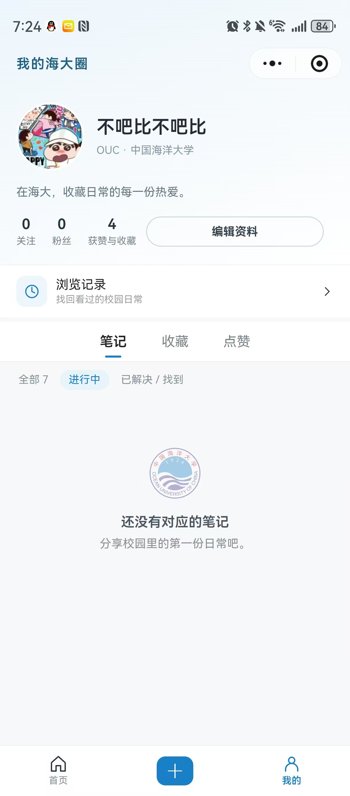
</p>

<p align="center">
  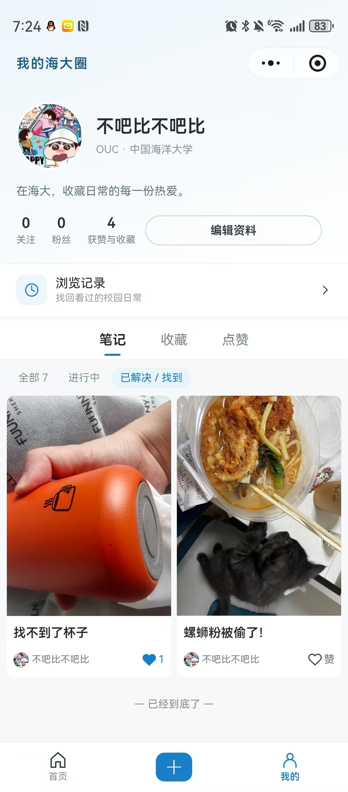
  
  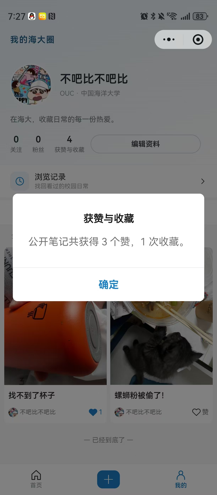
</p>

用户修改昵称或头像后，云函数会同步更新历史帖子和评论中的作者快照。只有当同步成功后，才会尝试删除旧头像文件，避免旧帖子引用失效。

### 7. 浏览历史

每次成功打开详情页时，云函数会记录浏览历史：

```js
await col('browse_history')
  .doc(idFor(openid, postId))
  .set({
    data: { openid, postId, viewedAt: Date.now() }
  })
```

因为文档 ID 与“用户 + 帖子”绑定，所以重复打开同一笔记不会不断增加重复记录，只会更新时间。

历史页按“今天 / 昨天 / 具体日期”分组，可以进入管理模式移除单条记录，也可以清空全部。清空时使用用户确认时的时间戳，只删除确认之前的历史，避免把确认后新产生的浏览记录一起误删。

<p align="center">
  
  
</p>

### 8. 关注与粉丝

关注关系保存在 `follows` 集合中，关系 ID 根据“关注者 + 被关注者”生成；事务同时维护关注者的 `followingCount` 和被关注者的 `followerCount`。

系统禁止关注自己，并支持重复请求幂等处理。

<p align="center">
  
  
</p>


## 五、实验总结

本次实验最大的收获不是单独学会某一个 API，而是第一次把微信小程序前端、云函数、云数据库、云存储和真实交互状态组织成了一套完整系统。

在实现“海大圈”的过程中，我进一步理解了：

1. 页面上一个简单的点赞按钮，背后实际涉及用户身份、关系唯一性、计数同步、并发、失败回滚和页面状态同步；

2. 一条评论不仅需要写入数据库，还需要考虑重复提交、回复目标、删除权限和评论数一致性；

3. 图片上传不能只考虑成功，也要考虑中途失败后如何清理已上传资源；

4. 浏览历史、收藏、点赞等数据虽然界面相似，但权限边界完全不同；

5. 云开发真正有价值的地方不是“把数据放到云端”，而是让身份、权限、业务逻辑和持久化形成完整闭环。

最终项目完成了从首页信息流、笔记发布、详情互动，到个人主页、关注粉丝和浏览历史的完整流程，并通过 39 项自动测试验证了主要业务逻辑。相较于只完成实验基础要求，本项目在 UI、功能完整度、数据一致性和异常处理方面都进行了进一步扩展。
