<center>姓名：伍紫涵  学号：24020007139</center>

| 姓名和学号？         | 伍紫涵，24020007139 |
| -------------------- | -------------------------------- |
| 本实验属于哪门课程？ | 中国海洋大学26夏《移动软件开发》 |
| 实验名称？           | 实验2：名片小程序 |
| 博客地址？           | 未发布（选做） |
| 代码仓库地址？       | https://github.com/qiqiqisi/ouc-mobile-software-development（选做） |

## 一、实验内容

本实验参考 [实验2：名片小程序 | OUC AI Lab](https://oucai.club/classes/Mobile/lab02)，目标是完成一个专属于自己的微信小程序名片。按照实验要求，小程序需要包含 AI 生成的 16:9 名片头图、个人文本介绍，并支持分享给别人。在完成基本要求的基础上，我又加入了个人词云、学业信息、项目经历和 GitHub 链接复制功能。

### 1. 最终效果

为了方便查看，先展示最终完成效果。页面整体采用白底和蓝色强调色，顶部为个人名片头图，下面依次是自我介绍、关键词词云、更多信息、项目经历和分享按钮。页面内容超过一屏后可以自然向下滑动查看。

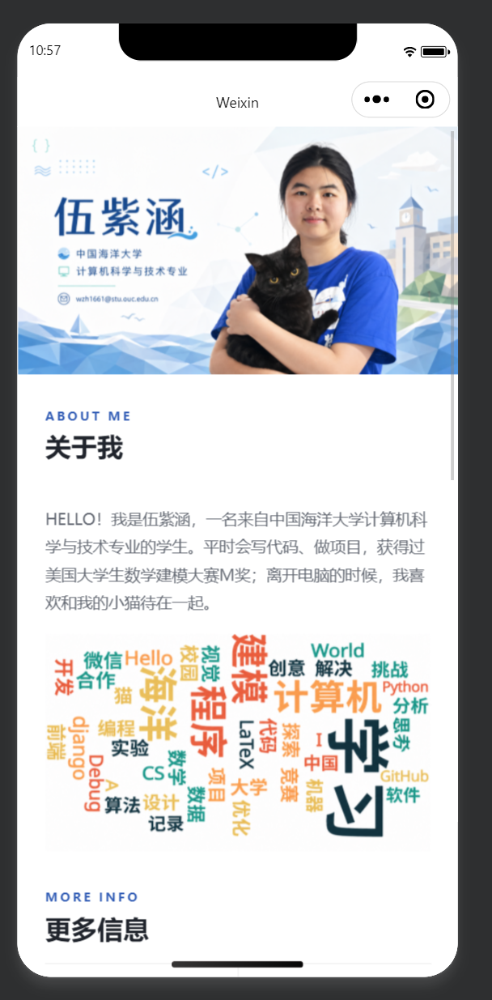

继续下滑可以查看个人学业信息和项目经历：

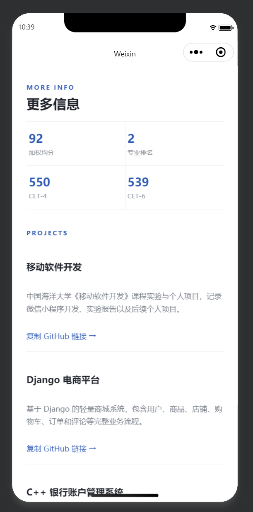

项目区展示了移动软件开发、Django 电商平台、C++ 银行账户管理系统和 LaTeX 作业集，并提供 GitHub 链接复制功能：

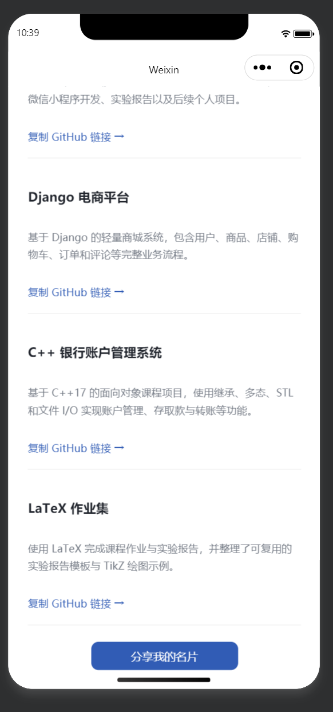

点击“分享我的名片”按钮后，可以调起微信小程序的分享界面，分享卡片使用个人名片头图作为封面：

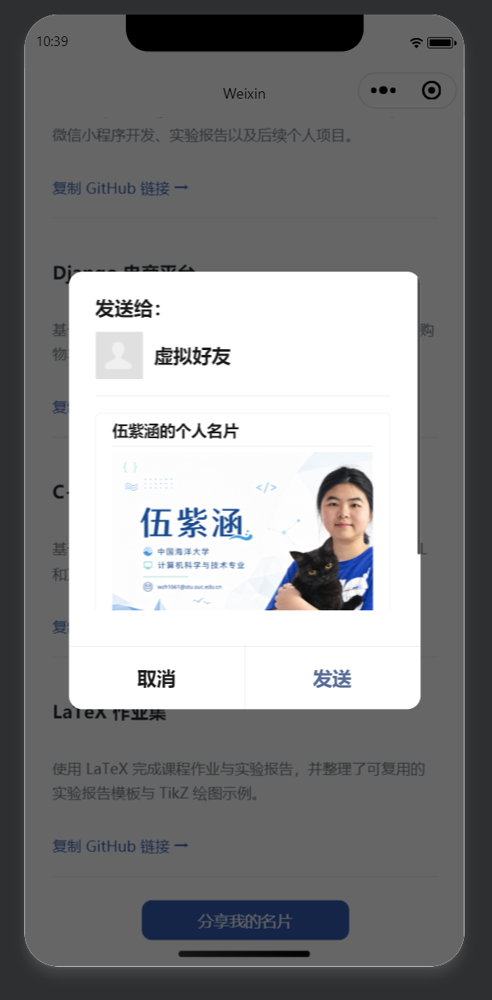

### 2. 环境准备

首先使用微信开发者工具创建小程序项目，选择 JavaScript 基础模板。项目创建后可以看到默认的头像、昵称和 Hello World 页面。

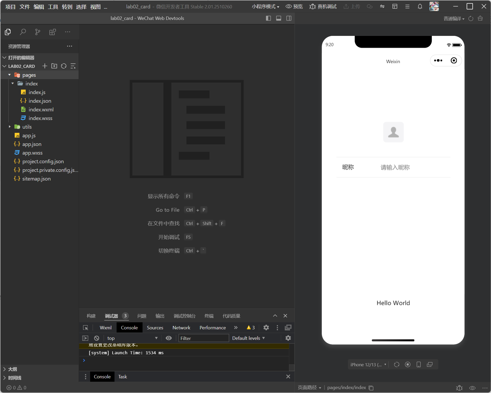

本实验主要使用以下文件：

```text
pages/index/index.wxml    页面结构
pages/index/index.wxss    页面样式
pages/index/index.js      页面逻辑
images/card-cover.png     个人名片头图
images/cloud.png          个人词云
```

通过这一步进一步熟悉了微信小程序页面中 WXML、WXSS 和 JavaScript 的基本分工：WXML 负责页面中“有什么”，WXSS 负责页面“长什么样”，JavaScript 负责交互和系统能力调用。

### 3. 显示个人名片头图

按照实验要求，我先制作了一张 16:9 的个人名片头图。图片以本人和小猫为主要内容，并加入中国海洋大学、计算机科学与技术专业、邮箱以及海洋和代码元素。

将图片保存到 `images/card-cover.png` 后，在 `index.wxml` 中使用 `<image>` 组件显示：

```xml
<image
  class="card-cover"
  src="/images/card-cover.png"
  mode="widthFix"
/>
```

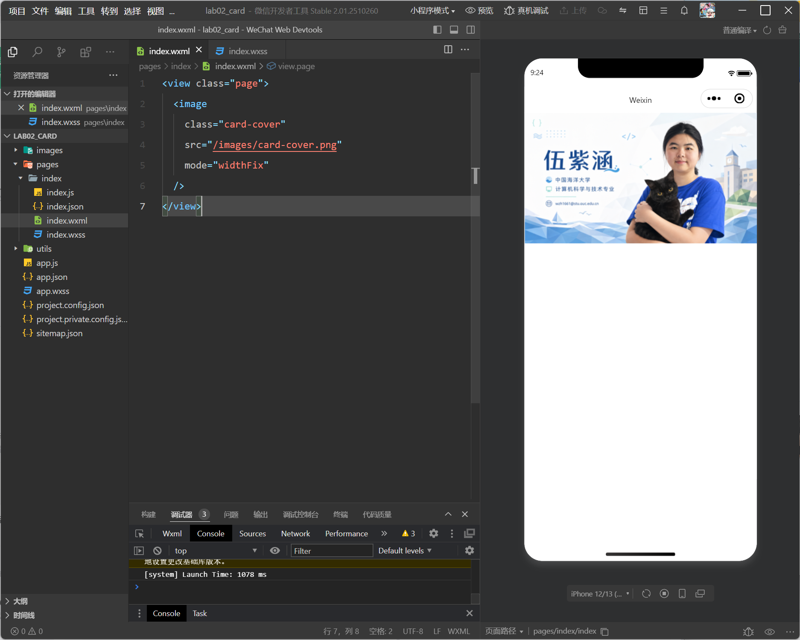

在 WXSS 中让图片占满页面宽度：

```css
.card-cover {
  display: block;
  width: 100%;
}
```

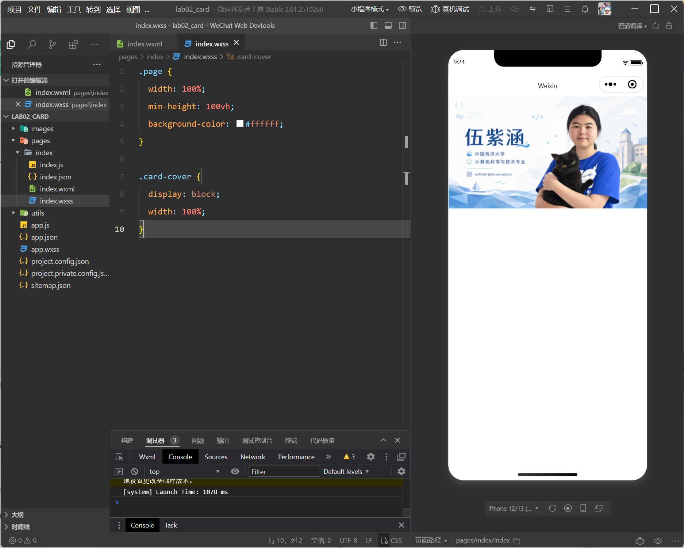

其中 `mode="widthFix"` 可以在宽度自适应页面的同时保持图片原来的宽高比例，避免人物和文字被拉伸。

### 4. 添加个人介绍

头图下方增加了 `ABOUT ME / 关于我` 区域，并使用比较自然的对话方式进行介绍，而不是制作成传统简历页面。

```xml
<text class="section-label">ABOUT ME</text>
<text class="section-title">关于我</text>
```

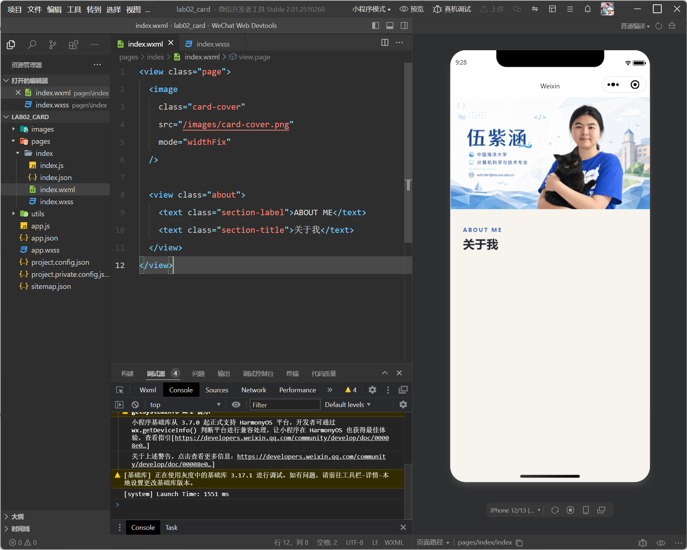

页面初步完成后的效果如下：

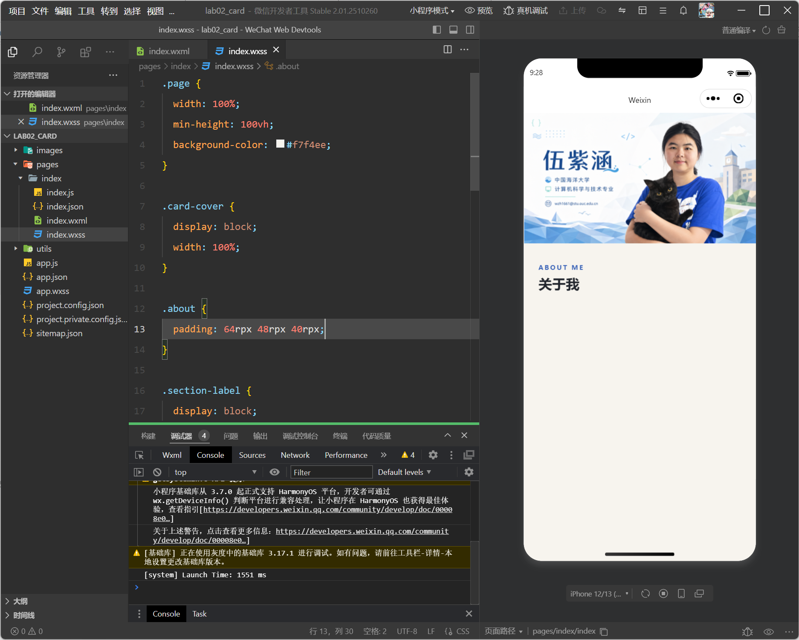

### 5. 添加个人词云

为了让个人介绍不只有一段文字，我又制作了一张个人关键词词云。词云中包含计算机、AI、科研、数学建模、Python、GitHub、小猫等关键词，用不同字号和颜色展示个人学习方向和兴趣。

将词云保存为 `images/cloud.png`，然后与头图一样使用 `<image>` 组件加载：

```xml
<image
  class="cloud-image"
  src="/images/cloud.png"
  mode="widthFix"
/>
```

对应的页面结构如下：

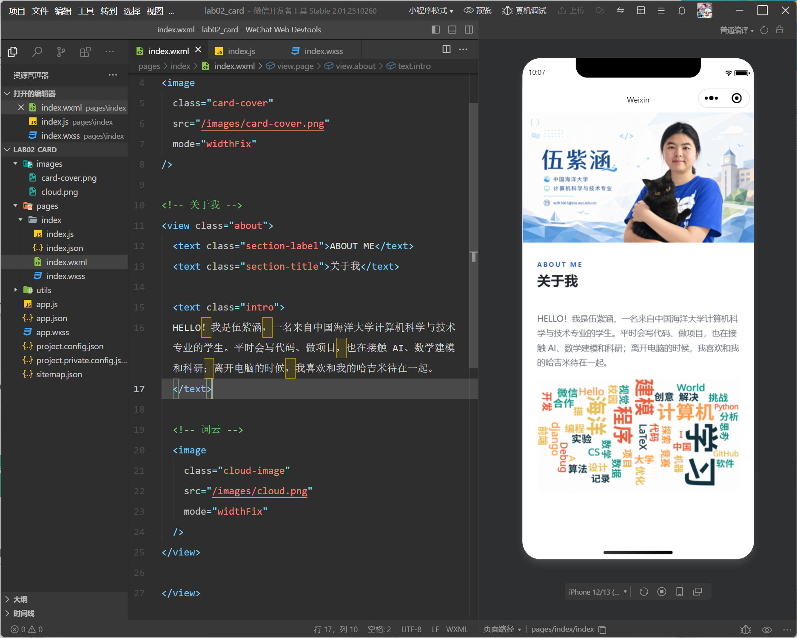

为了让词云白色背景能够自然融入页面，页面整体也采用白色背景，并通过间距、字号和蓝色强调色形成层级：

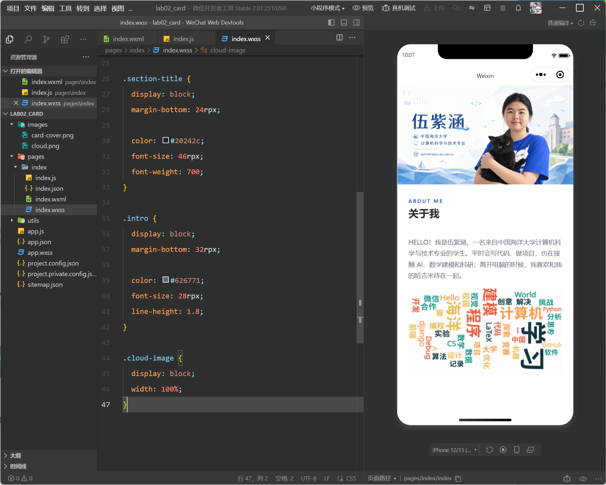

### 6. 添加“更多信息”

在词云下方增加 `MORE INFO / 更多信息` 区域，用两列布局展示较重要的个人学习信息。

页面采用简洁的分割线而不是大量圆角卡片，使信息比较清晰，同时保持整体风格统一。

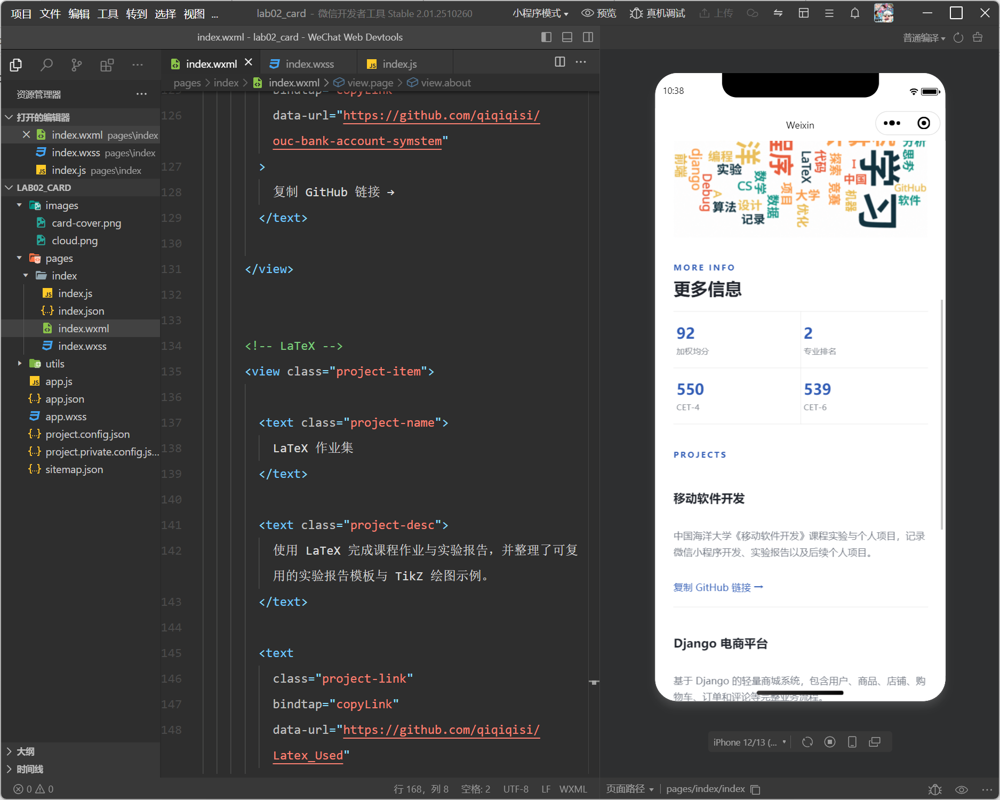

继续完善后，又在下方加入项目经历区域：

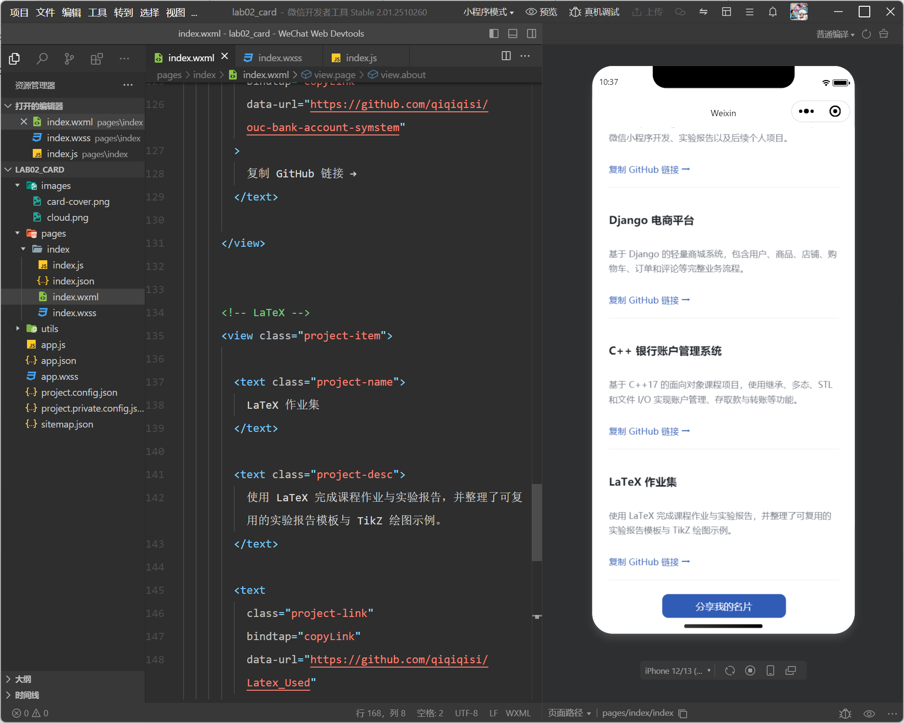

### 7. 展示个人项目

项目区共展示四个项目。

为了避免为每一个项目分别编写复制函数，我在 WXML 中使用 `data-url` 保存不同的 GitHub 地址：

```xml
<text
  class="project-link"
  bindtap="copyLink"
  data-url="https://github.com/qiqiqisi/django-shopping-websites"
>
  复制 GitHub 链接 →
</text>
```

然后统一由 `copyLink()` 处理：

```js
copyLink(e) {
  const url = e.currentTarget.dataset.url

  wx.setClipboardData({
    data: url,
    success() {
      wx.showToast({
        title: '链接已复制',
        icon: 'success'
      })
    }
  })
}
```

点击项目链接后，GitHub 地址能够成功写入剪贴板，并显示“链接已复制”提示。

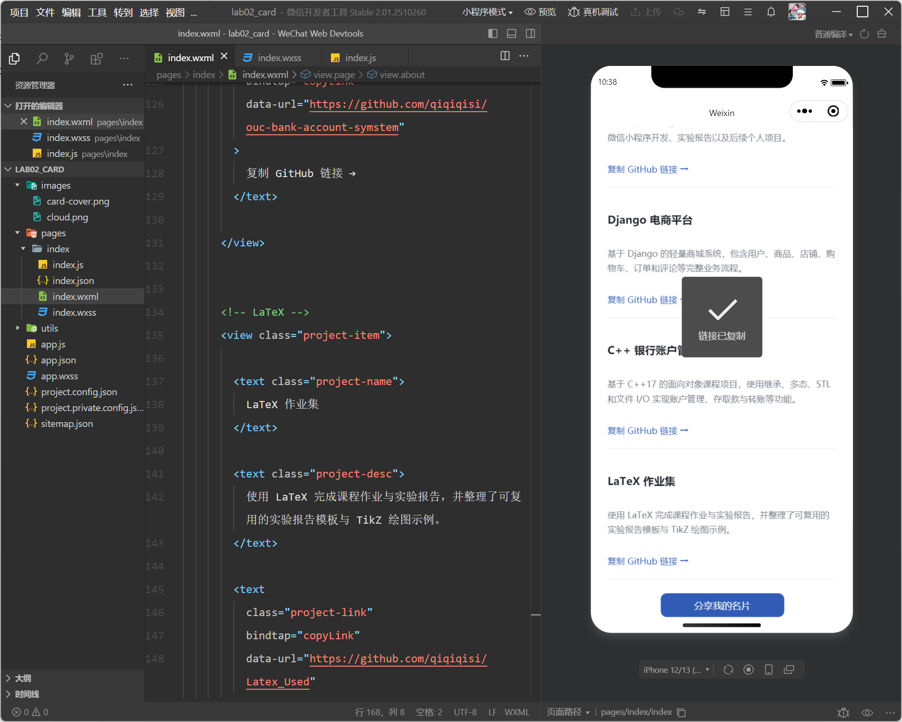

### 8. 实现名片分享

实验要求名片可以分享给其他用户，因此页面底部增加了分享按钮：

```xml
<button class="share-button" open-type="share">
  分享我的名片
</button>
```

`open-type="share"` 表示这个按钮使用微信提供的分享能力。JavaScript 中通过 `onShareAppMessage()` 指定分享内容：

```js
Page({
  onLoad() {
    wx.showShareMenu({
      menus: ['shareAppMessage']
    })
  },

  onShareAppMessage() {
    return {
      title: '伍紫涵的个人名片',
      path: '/pages/index/index',
      imageUrl: '/images/card-cover.png'
    }
  }
})
```

其中：

- `wx.showShareMenu()` 用于开启当前页面的分享入口；
- `title` 设置分享卡片标题；
- `path` 指定好友点击分享卡片后进入的页面；
- `imageUrl` 设置分享卡片使用的封面图。

分享功能对应的代码和调试过程如下：

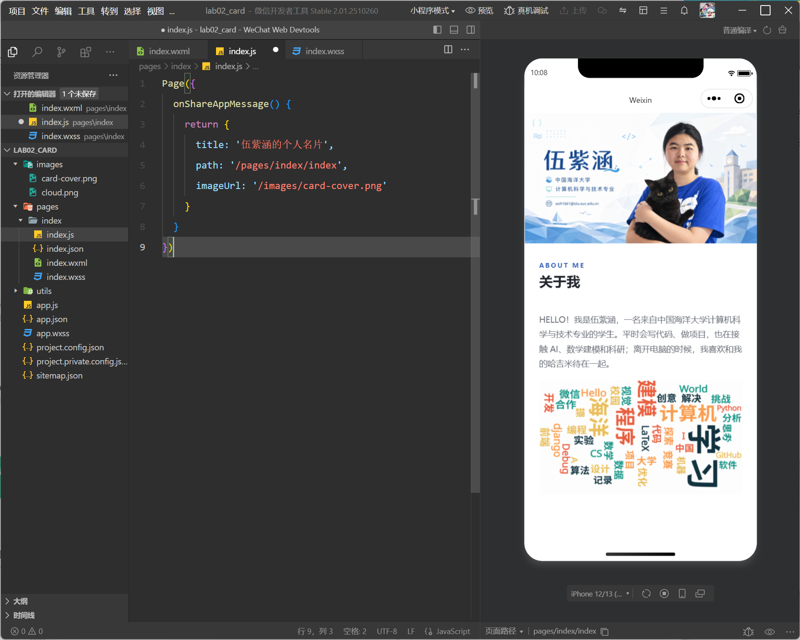

点击页面中的分享按钮后可以正常打开分享界面：

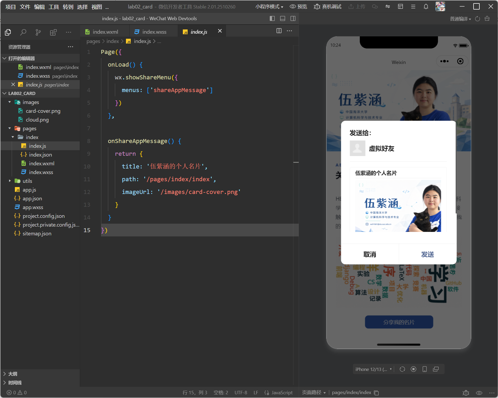

至此，实验要求中的“头图、文本描述、可以分享给别人”均已完成，同时又增加了个人词云、学业信息、项目展示和链接复制等扩展内容。

## 二、问题总结与体会

### 1. 图片比例和显示问题

一开始将名片图片放入页面时，需要处理图片路径以及不同手机宽度下的显示比例。如果直接设置固定高度，图片容易出现拉伸或裁剪。最后使用 `width: 100%` 配合 `mode="widthFix"`，让图片根据页面宽度自动计算高度，既可以占满页面宽度，也不会破坏原图比例。

这让我对小程序中本地静态资源的路径写法以及 `<image>` 组件的显示模式有了更直观的理解。

### 2. 页面设计不断调整

最开始个人介绍区域比较简单，只展示了头图和文字。后来尝试加入标签式关键词，但实际效果比较规整，也和个人名片的整体风格不够统一。最终改成独立的词云图片，并将页面调整为白底、蓝色强调和较多留白的布局。

这个过程让我意识到，前端开发不仅要保证代码能够运行，还需要考虑信息层级、颜色、间距和图片比例。功能正确并不代表页面最终效果一定合适，需要不断在模拟器中查看和调整。

### 3. GitHub 外部链接问题

项目经历中需要展示 GitHub 地址，但微信小程序并不能像普通网页一样直接使用普通超链接跳转到任意外部网站。如果使用 `web-view`，还涉及业务域名配置，对本次实验来说比较复杂。

最后选择使用 `wx.setClipboardData()` 实现“复制 GitHub 链接”。用户点击项目链接后，程序读取对应元素的 `data-url`，复制到剪贴板，并使用 `wx.showToast()` 给出反馈。这个方法实现简单，也比较适合实验场景。

### 4. 实验收获

相比实验1，本次实验加入了图片资源、页面布局、词云、项目展示、链接复制和微信分享等功能。

通过实际开发，我更加明确了 WXML、WXSS 和 JavaScript 的分工，也对 `widthFix`、`data-*`、`wx.setClipboardData()` 和 `onShareAppMessage()` 等小程序常用功能有了更直观的理解。
